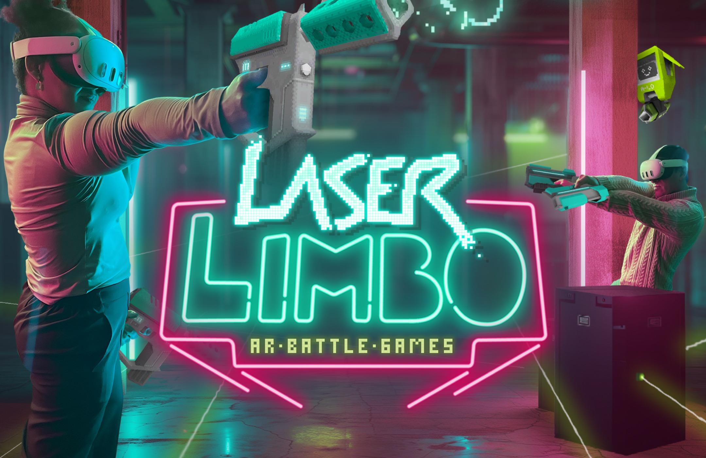
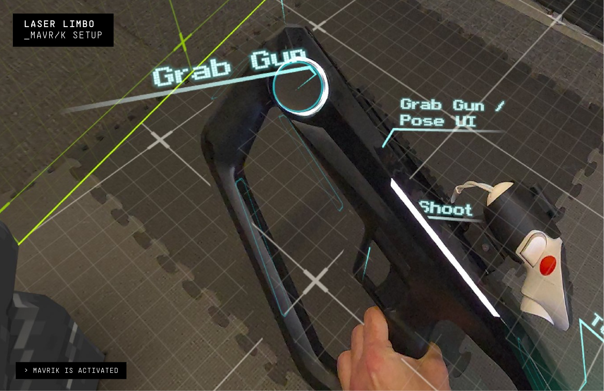

# Laser Limbo

## Laser Limbo & the Mavrik: Your Arena is Everywhere

Laser Limbo is a revolutionary mixed-reality experience that brings the virtual world to life. Turn your home, office, or backyard into an arena! **And with the Mavrik Blaster, you'll feel all the action!**

Create maps that fit seamlessly within any space, navigate around obstacles, and extend across multiple rooms for an unparalleled gaming experience. Play against your friends or challenge your rivals in cooperative or head-to-head modes.

- **Redefining Gaming:** The Mavrik Blaster enhances every interaction with powerful haptic feedback, providing a new level of immersive gameplay.
- **Play Anywhere:** Inside, outside, and even across multiple rooms!
- **Mixed Reality Gameplay:** Transform your space into the ultimate arena by seamlessly blending virtual elements with your physical environment.
- **Player Modes:** Play solo or compete with up to four players.
- **Skill-Driven Fun:** Perfect for sharpening reflexes, building strategy, and outsmarting opponents.

  <iframe
    title="Laser Limbo and the Mavrik video"
    src="https://www.youtube.com/embed/ApwvnEDC-to?wmode=opaque&rel=0"
    allow="accelerometer; autoplay; clipboard-write; encrypted-media; gyroscope; picture-in-picture; web-share"
    allowFullScreen
  />

---

## Laser Limbo Setup

**Run StrikerConnect**

The StrikerConnect app must be running before launching any game content. If StrikerConnect is not running, the Mavrik blaster will not be recognized. In this case, quit the game, start StrikerConnect, and then relaunch the game.

Once StrikerConnect is running, the game will autodetect the Mavrik and it will be labeled.

---

## Having Connection Issues?

Visit our [Mavrik troubleshooting article](/docs/mavrik-at-home/mavrik-troubleshooting/troubleshooting-connection).

---

## Connect with Laser Limbo

<ul className="socialLinks">
  <li><a href="https://discord.gg/T46nfPXebv">Discord</a></li>
  <li><a href="https://x.com/freeroamAR">X</a></li>
  <li><a href="https://www.instagram.com/ar_lasertag_berlin/">Instagram</a></li>
  <li><a href="https://www.tiktok.com/@freeroam.ar">TikTok</a></li>
</ul>
