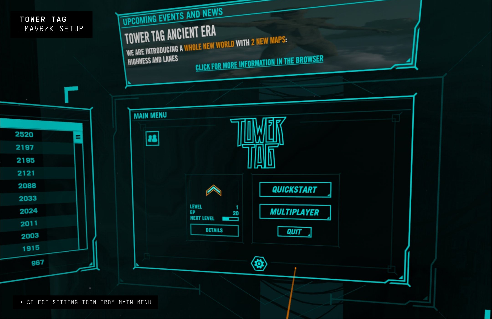
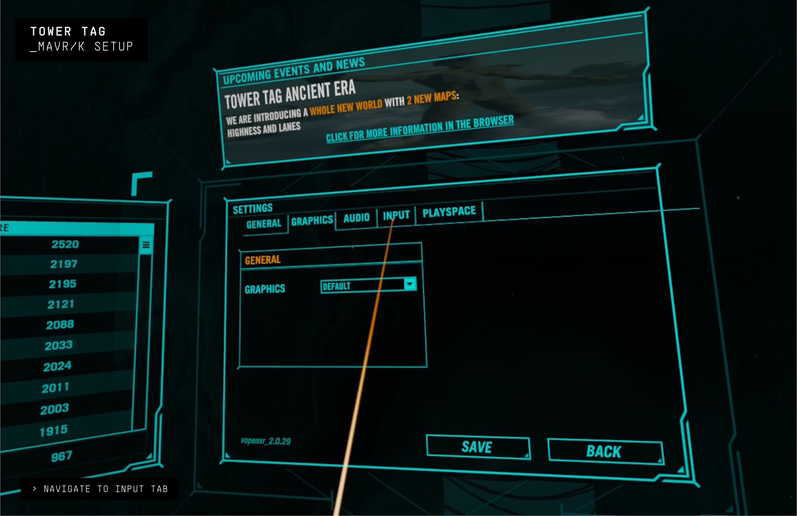
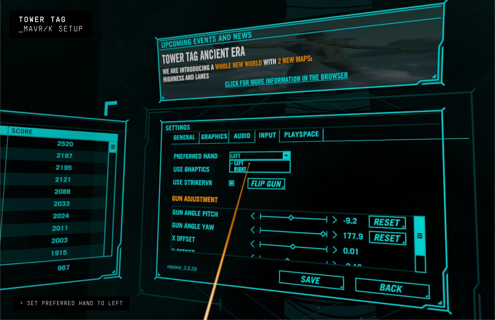
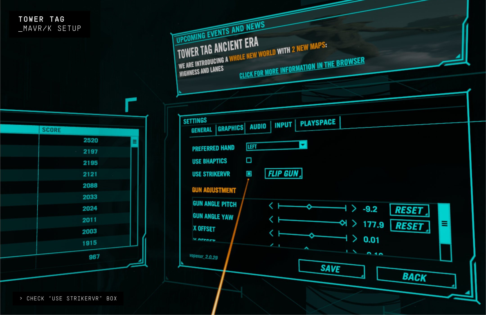
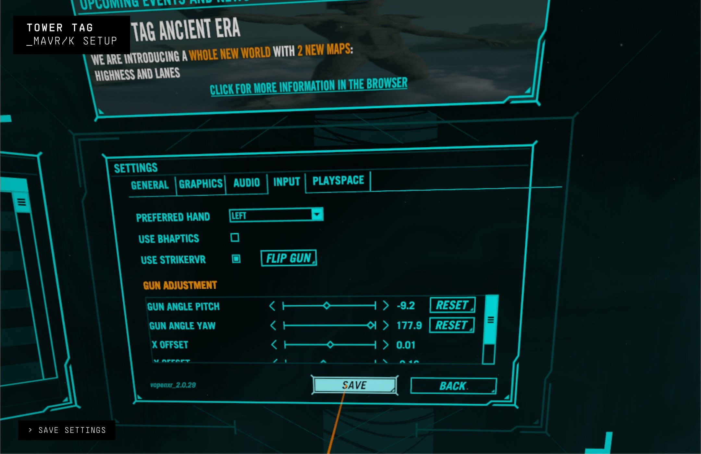
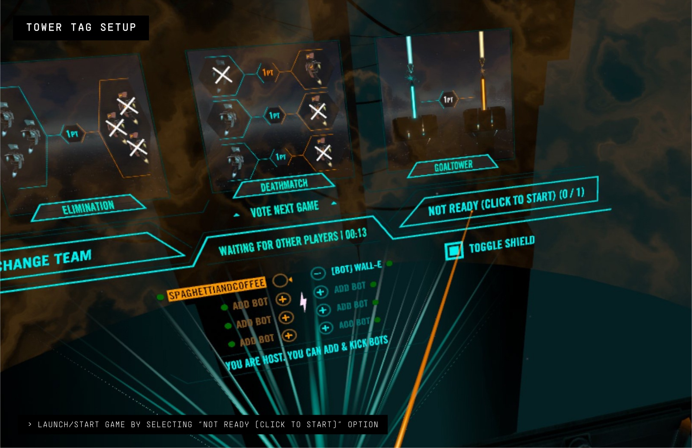

# Tower Tag

  <iframe
    title="Tower Tag and the Mavrik video"
    src="https://www.youtube.com/embed/yzTI4K75U10?feature=shared&wmode=opaque&rel=0"
    allow="accelerometer; autoplay; clipboard-write; encrypted-media; gyroscope; picture-in-picture; web-share"
    allowFullScreen
  />

## Tower Tag & the Mavrik: The Ultimate Competitive VR Shooter

#### Join forces, capture towers, and dominate the battlefield with tactical precision. Experience hyper-dynamic action and thrilling PvP battles now enhanced with the Mavrik!

- **Multiplayer:** Enjoy cross-platform multiplayer across various mobile VR platforms.
- **Match Variety:** Engage in 1v1, 2v2, 3v3, and 4v4 matches.
- **Motion Sickness-Free:** Experience smooth grappling hook movement and intuitive paintball mechanics without discomfort.
- **Room-Scale:** Ability to play even in small areas.
- **Intelligent Bots:** Practice and fill matches with smart AI opponents.
- **Ranked Play:** Climb the rankings with platform-specific leaderboards.

---

## Tower Tag Setup

### Run StrikerConnect

The StrikerConnect app must be running before launching any game content. If StrikerConnect is not running, the Mavrik blaster will not be recognized. In this case, quit the game, start StrikerConnect, and then relaunch the game.

### Enable the Mavrik Blaster for Tower Tag

The Mavrik will need to be enabled the first time playing Tower Tag. Setup is easy--follow the steps below.

1. In the Main Menu, select the gear icon to navigate to Settings.

   

2. In Settings, click the **Input** tab.

   

3. In the Input tab under **Preferred Hand**, select **Left** from the drop-down menu.

   

4. Next, make sure the checkbox next to **Use StrikerVR** is filled/checked.

   

5. You can adjust the offsets of your blaster by using the **Gun Adjustment** section. We prefer the following adjustments:

   - Gun Angle Pitch: -9.2
   - Gun Angle Yaw: 177.9
   - X Offset: 0.01
   - Y Offset: -0.16
   - Z Offset: 0.17

6. Save all settings. Your Mavrik is now enabled.

   

7. Set options such as match type, bots, and team, then launch the game by clicking **Not Ready (click to start)**.

   

---

## Gameplay

Tower Tag gameplay is simple and intuitive.

- **Shoot blaster:** Pull the trigger to fire. Pull and hold for multi-shot.
- **Fire grappling hook:** Touch the touchpad. Jump to the platform by moving the blaster quickly in a downward direction while holding the touchpad.
- **Game Menu:** Press **F1** to open or close the menu.

---

## Having Connection Issues?

Visit our [Mavrik troubleshooting article](/docs/mavrik-at-home/mavrik-troubleshooting/troubleshooting-connection).

---

## Connect with Tower Tag

<ul className="socialLinks">
  <li><a href="https://discord.gg/nGsCvEQ">Discord</a></li>
  <li><a href="https://www.youtube.com/channel/UC8wcEk76jAWYUTLPp68zfjw">YouTube</a></li>
  <li><a href="https://www.instagram.com/towertag/">Instagram</a></li>
  <li><a href="https://www.facebook.com/TowerTagVR/">Facebook</a></li>
</ul>
