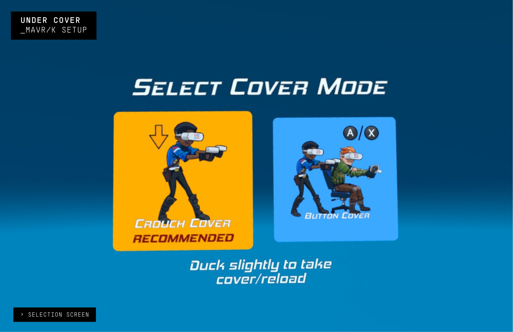
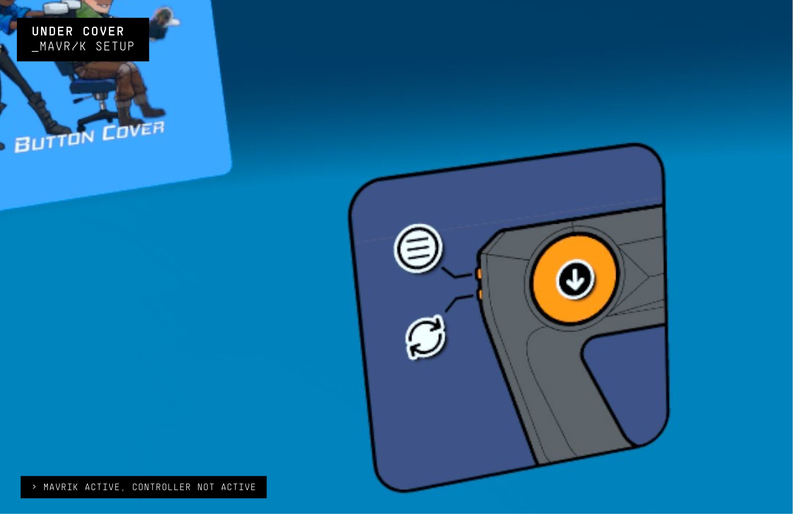
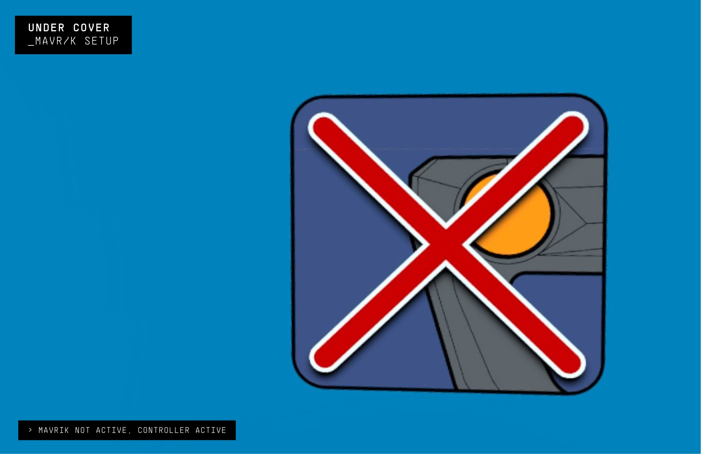

# Under Cover

  <iframe
    title="Under Cover and the Mavrik video"
    src="https://www.youtube.com/embed/YHbopImfz6Y?wmode=opaque&rel=0"
    allow="accelerometer; autoplay; clipboard-write; encrypted-media; gyroscope; picture-in-picture; web-share"
    allowFullScreen
  />

## Under Cover & the Mavrik: Arcade Action in Your Home

Under Cover is an FPS game inspired by arcade shooter classics. Duck to reload with the groundbreaking Active Cover System. Rack up solo or co-op high scores as Red-Eye or Magnum - two undercover agents too cool to stay undercover - in the action-packed buddy-cop campaign.

Your mission: infiltrate evil megacorp Infinidyne and shut down its mind-control technology before billions are turned into cybernetic meat puppets. Are you ready to go Under Cover?

- **Next-Level Immersion:** Feel every move with the Mavrik blaster's haptic feedback!
- **Simple Controls:** Easy-to-understand controls allow players to jump right into the game.
- **Player Modes:** Play solo with an AI partner or co-op with an online friend.
- **Be An Action Hero:** Over-the-top cinematic action with explosions, bullet time, and environmental destruction.

---

## Under Cover Setup

**Run StrikerConnect**

The StrikerConnect app must be running before launching any game content. If StrikerConnect is not running, the Mavrik blaster will not be recognized. In this case, quit the game, start StrikerConnect, and then relaunch the game.

Once StrikerConnect is running, the game will autodetect the Mavrik. At the selection screen, players can switch between the Mavrik and the right controller by pulling the trigger on either device.

**Mavrik Active:**

The **F1** button opens the menu.

**Mavrik Not Active:**

---

## Having Connection Issues?

Visit our [Mavrik troubleshooting article](/docs/mavrik-at-home/mavrik-troubleshooting/troubleshooting-connection).

---

## Sigtrap Games / Under Cover

<ul className="socialLinks">
  <li><a href="http://www.sigtrapgames.com/">Sigtrap Games</a></li>
  <li><a href="https://undercovervr.com/">Under Cover Website</a></li>
</ul>
