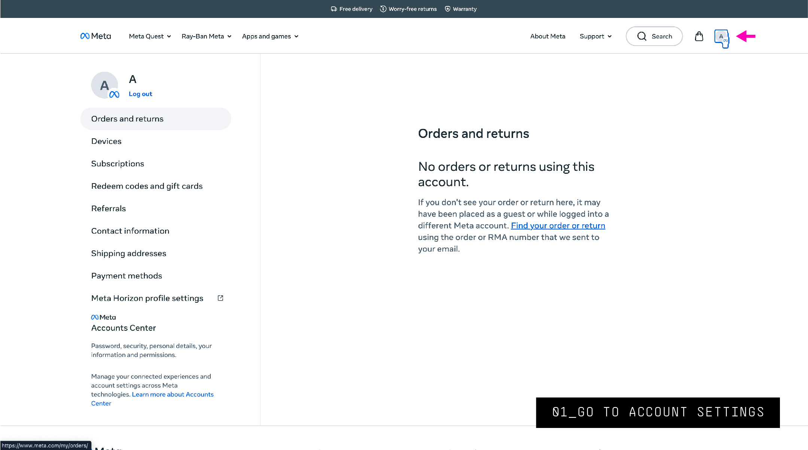
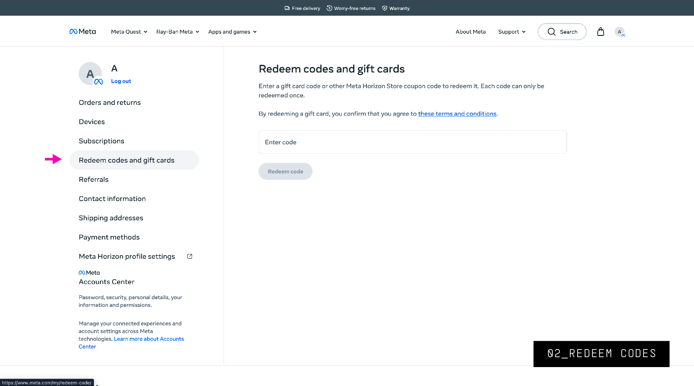
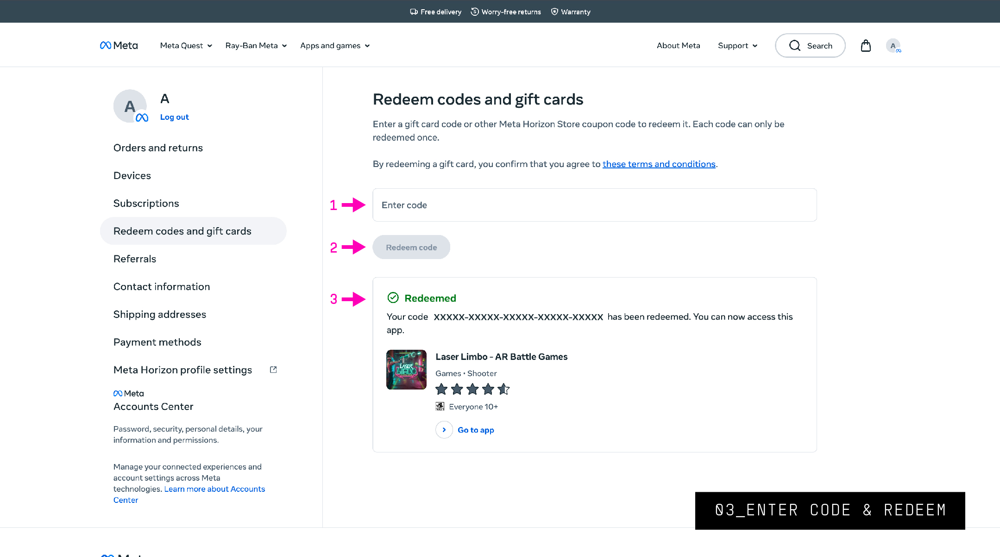
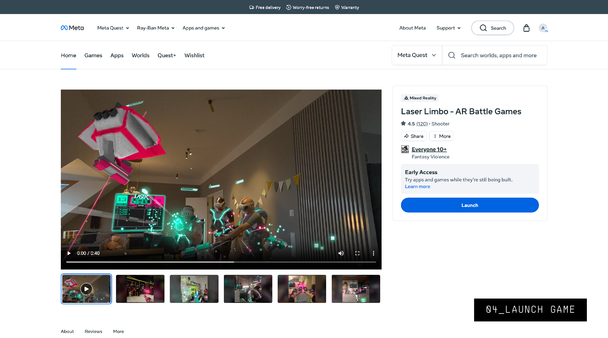
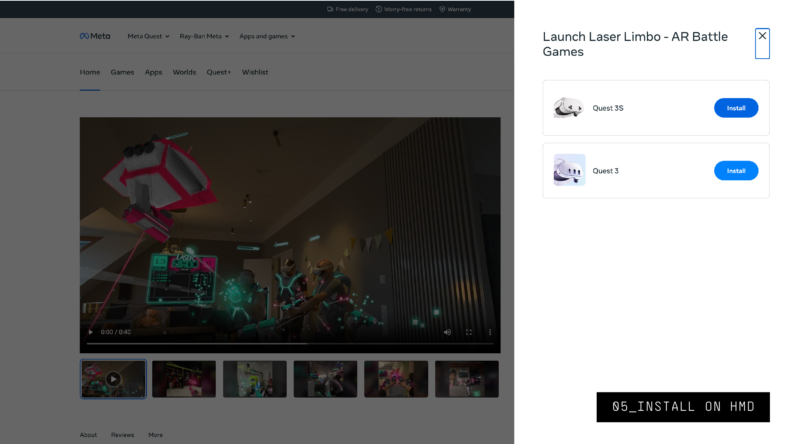
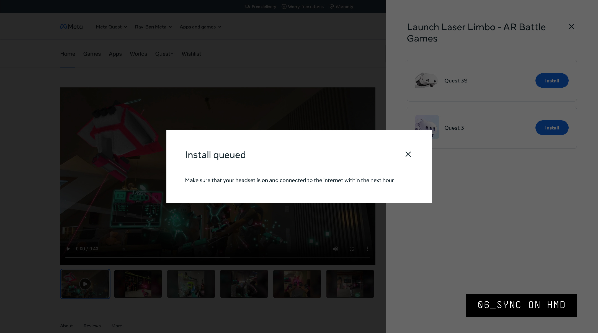
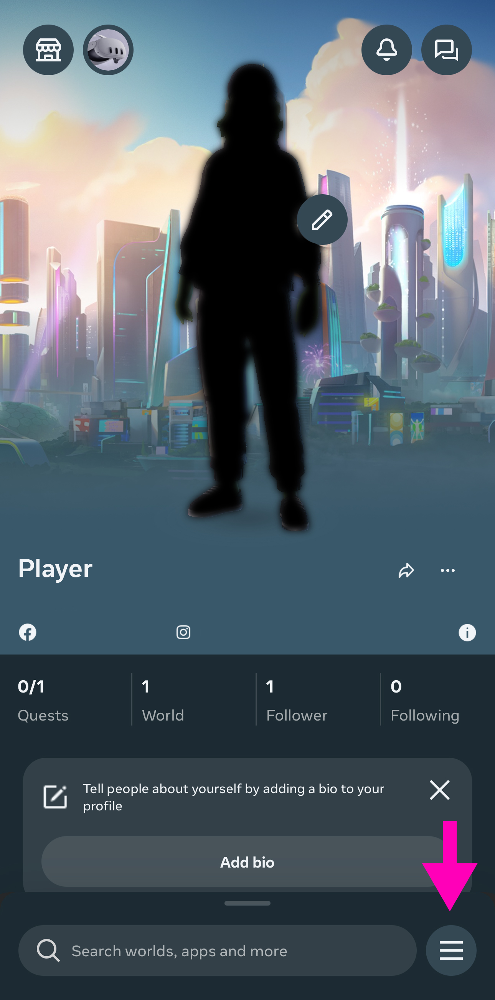
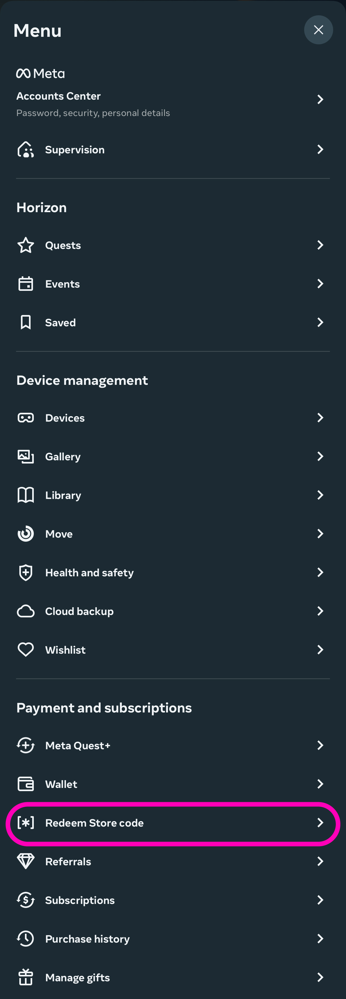
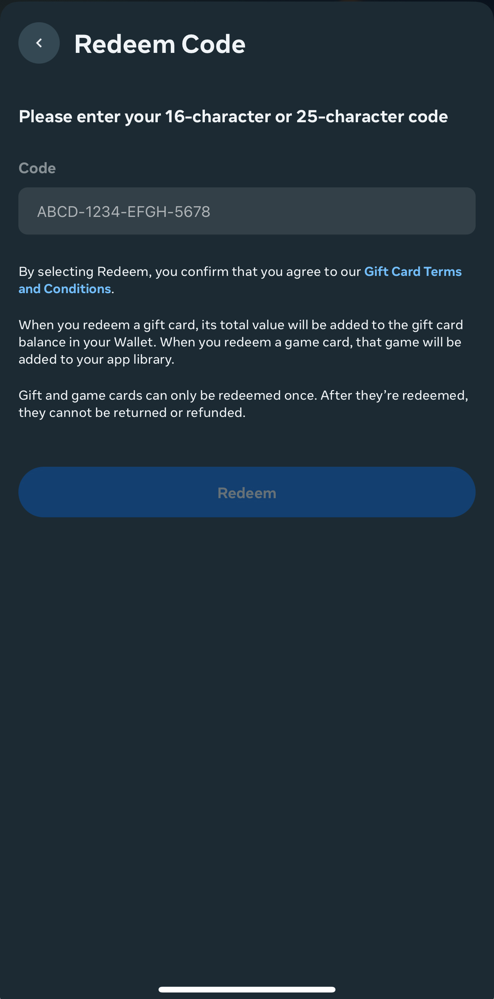

# Using Your Bundle Game Keys

After purchasing your blaster, you will receive an email with your game keys. These keys enable you to download the bundle titles for free.

:::warning
Do not share these keys, as these are not reusable. Game keys are only issued once for every purchase.
:::

## Desktop Install

1. Log into your [Meta account](https://www.meta.com/) and navigate to your account settings.

   

2. In the left panel, select **Redeem codes and gift cards**.

   

3. Enter your game key and redeem the code. You will receive a redeemed verification.

   

4. On the game page, you now have the option to launch. Click **Launch**.

   

5. Install the game on your Quest headset.

   

6. Sync on your headset.

   

## Mobile Install

1. Open your [Meta Horizon App](https://www.meta.com/help/quest/articles/getting-started/getting-started-with-quest-2/install-meta-horizon-mobile-app/?srsltid=AfmBOoo8d38vnQKDm3iHql9Iq3XVcOCt96midL4R6BqUv3lNq_K8Qm7j) and click the menu button in the lower right corner.

   

2. Scroll down and select **Redeem Store code**.

   

3. Enter the code and redeem it.

   
