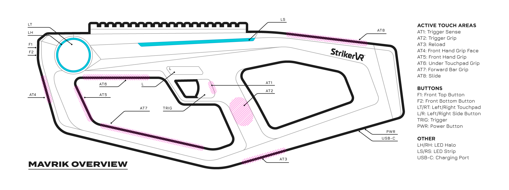
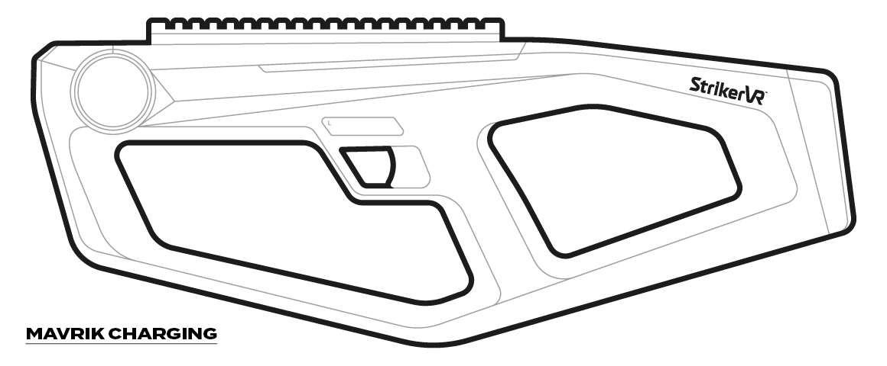

# General Information

## Mavrik Overview

| Active Touch Areas | Buttons | Other |
| --- | --- | --- |
| AT1: Trigger Sense AT2: Trigger Grip AT3: Reload AT4: Front Hand Grip Face AT5: Front Hand Grip AT6: Under Touchpad Grip AT7: Forward Bar Grip AT8: Slide | F1: Front Top Button F2: Front Bottom Button LT/RT: Left/Right Touchpad L/R: Left/Right Side Button TRIG: Trigger PWR: Power Button | LH/RH: LED Halo LS/RS: LED Strip USB-C: Charging Port |

## Powering Up Your Mavrik

To start up the device, press and hold the **Power (PWR)** button for 2 seconds. Avoid using excessive force. The Power button is located on the back underside of the Mavrik.

- The device will begin its startup sequence, and you will hear and feel the movement of the haptic engines.
  - The startup sequence ends when the LED strip on the side of the device shows solid blue and the haptic engines have ceased motion.
- After powering on, the Mavrik is automatically set to **demo mode** for initial startup. Once the Mavrik is paired with a headset, it will automatically connect via Bluetooth on startup.
  - You can use demo mode to explore the haptics of the blaster. Cycle through different touch experiences by pressing the **L / R Side buttons** and squeezing the **Trigger**.

## Connection

Upon initial startup, if no buttons have been pressed for 15 seconds and the blaster is not connected to a headset, the blaster will blink blue. This means it is advertising/searching for a Bluetooth connection.

## Charging Your Mavrik

- Plug the **USB-C** charging cable into the power adapter and an outlet. Make sure you are utilizing the appropriate converter adapter.
- Plug the other end of the charging cable into the **USB-C** charging port located next to the Power button.
- When the Mavrik is charging, the LED strip on the side of the device will show green lights moving in a back-to-front motion.
- The Mavrik should be fully charged in one hour. When the Mavrik is fully charged, the LED strip will flash solid green.

## Bluetooth Unpairing

The Mavrik must be unpaired by the connected HMD or the HMD must be powered off prior to unpairing by Mavrik.

To clear the current pairing:

1. With the device **ON**, hold both **Side buttons (L & R)**. The LED strip will blink blue 3 times, then all lights will turn off.
   - The device may appear to be off after the lights go out, but the Mavrik is still on.
2. Power cycle the Mavrik by powering it off, waiting 10 seconds, and powering it on to complete the unpairing.

## Compatibility

The StrikerVR Mavrik is currently only compatible with Meta Quest 3 & 3S headsets for standalone use. 
PCVR via Steam coming soon. Contact support@strikervr.com for StrikerLink Beta with Steam support.
