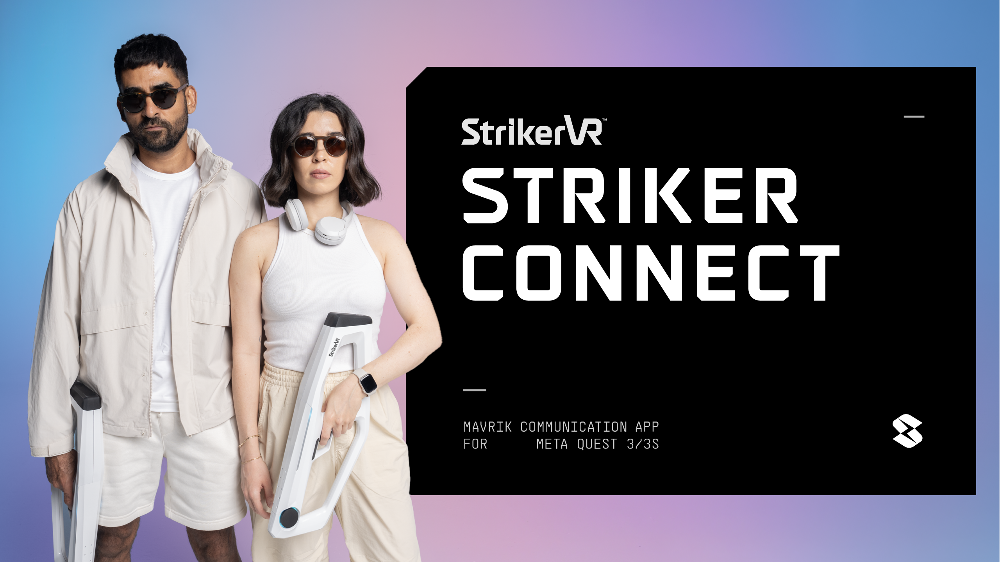
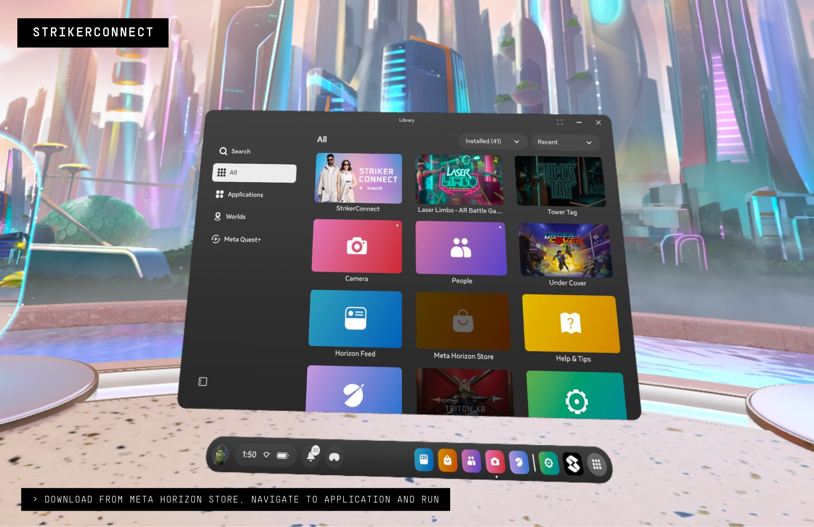
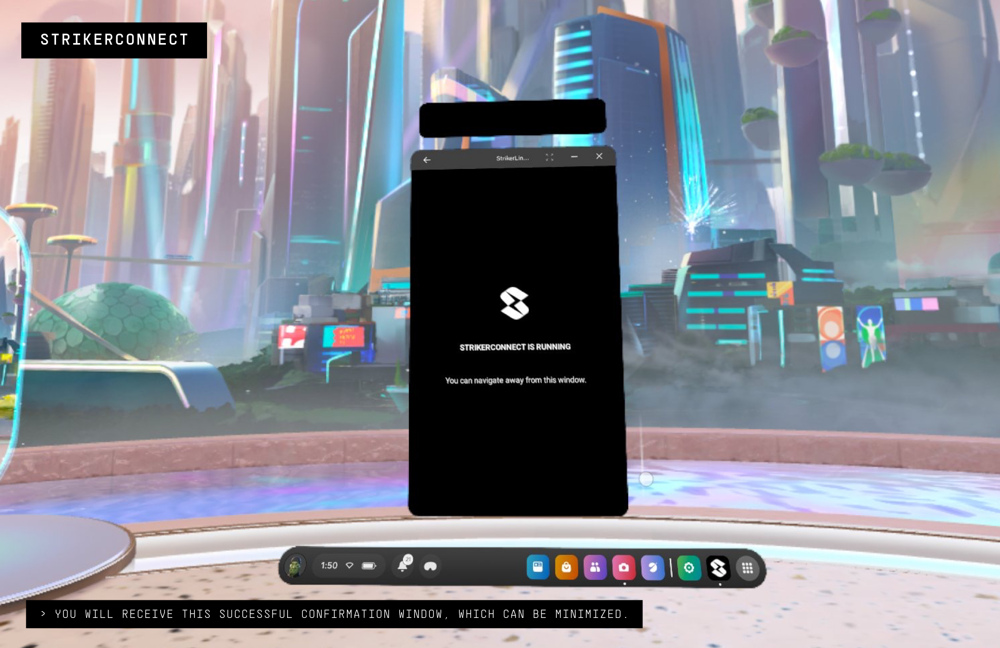
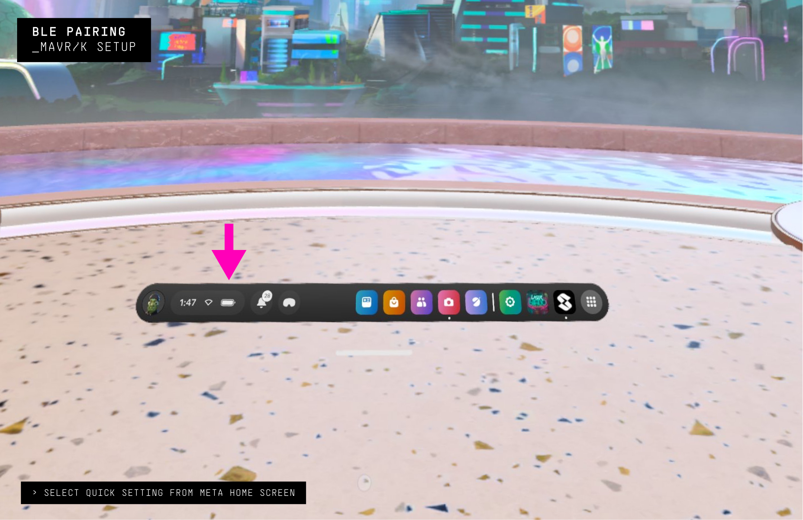
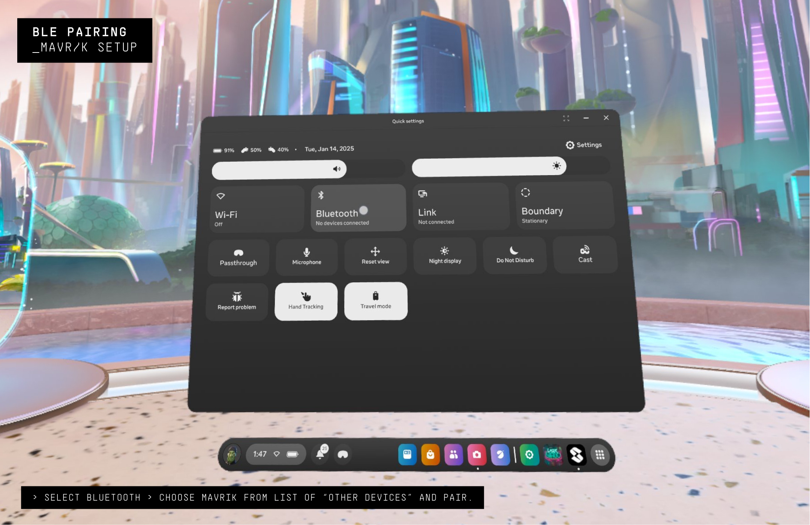
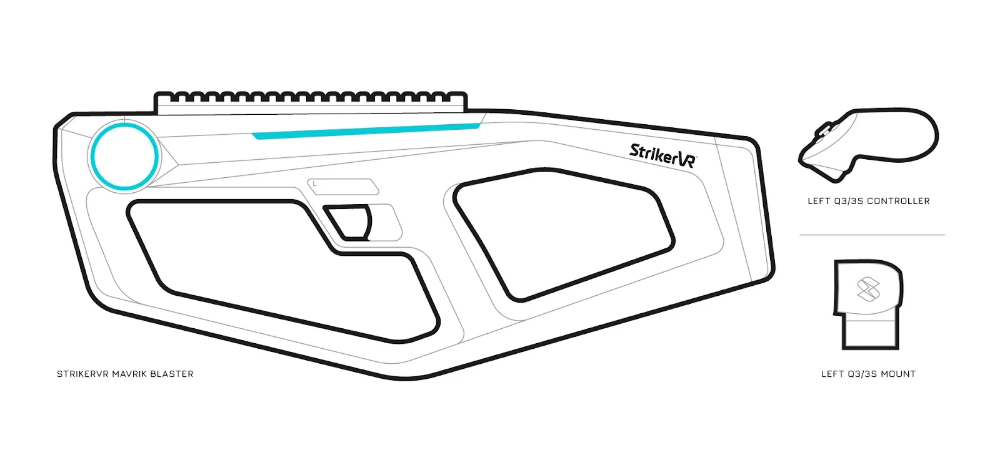
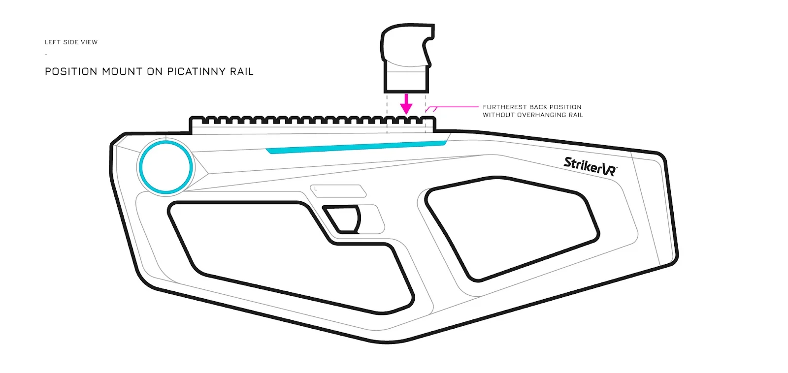
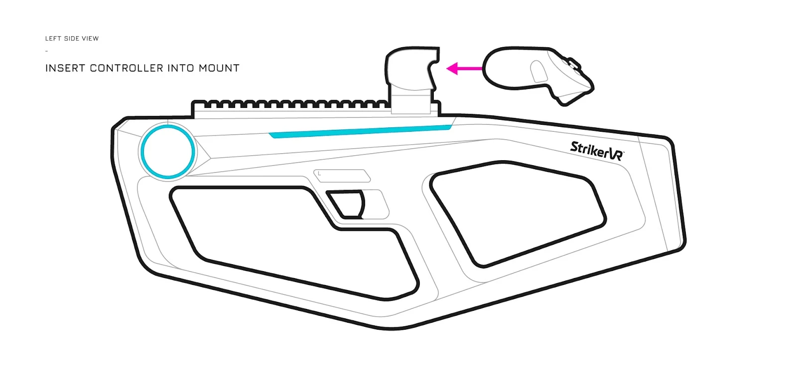
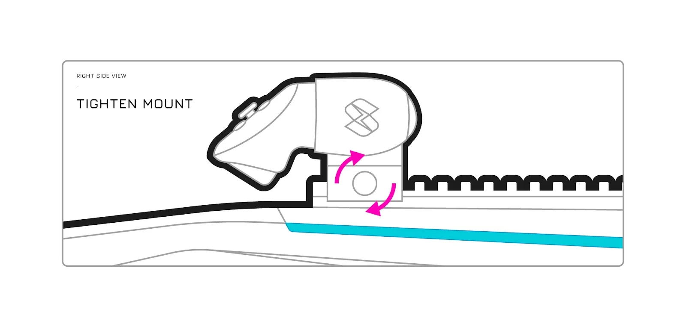
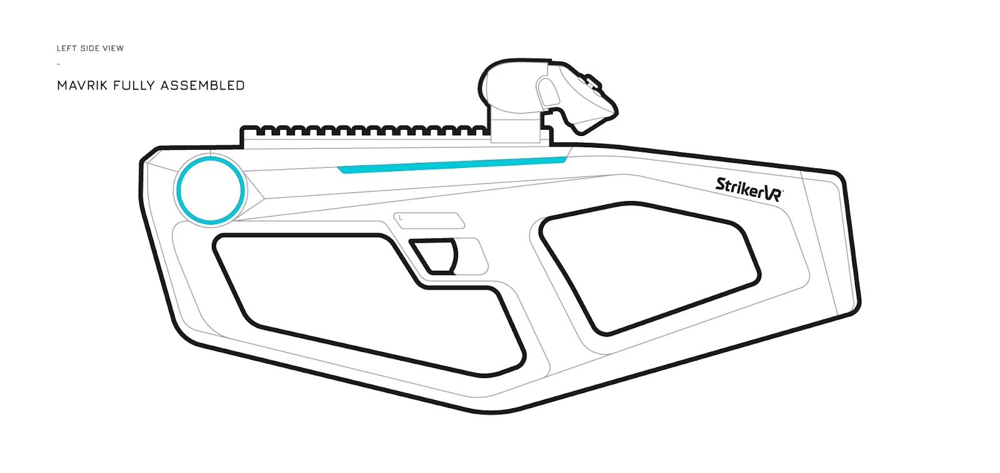

# Mavrik Quick Start Guide

## Step 1: Install StrikerConnect on Your Headset

**StrikerConnect** is the application that allows your Meta headset to connect to the *Mavrik*. Without installing StrikerConnect, the blaster will not work with your headset.

1. Download and install the [**StrikerConnect**](https://www.meta.com/experiences/strikerconnect/8493705144039064/?ref=fsitmeyu&sub_id=undefined) application from the Meta Horizon Store.

   

2. Locate the StrikerConnect app in your library and run it. This application must be running to use your Mavrik blaster.

    

3. You may receive a popup window that states, "Pair with Mavrik?" and features a 6-digit pairing code. Click the **Pair** button in this window. Allow permissions and access to Bluetooth if necessary.

   You will only need to enter the pairing code once, unless you remove the Mavrik from your connected devices list.

4. A window will appear stating that StrikerConnect is running. You can navigate away from this window.
    
    

---

## Step 2: Pair Your Mavrik to Your Headset

After you have **StrikerConnect** installed and running, you can pair the Mavrik to your headset.

1. Power on your Mavrik blaster.
2. On your headset, navigate to **Quick Settings > Bluetooth Manager > Settings**.
    
   
    
   
3. Select your Mavrik device for pairing.

   When a connection is made to StrikerConnect, the Mavrik LEDs will be solid cyan, and your blaster is now waiting to connect to a game.

---

## Step 3: Assemble Your Hardware

**Parts List**

- Mavrik
- StrikerVR Controller Mount
- LEFT hand controller

1. Position your Meta Quest 3/3S Controller Mount on the rail. The mount must be located at the back-most point without overhanging the rail. Do not tighten yet.
    

2. Insert the Meta Quest 3/3S left-hand controller.
    

3. Tighten the mount in place by twisting the thumb screw.
    

4. The mount and controller are now secured to the Mavrik.
    

5. To remove the left-hand controller, completely loosen and open the mount.

---

## Step 4: Access Your Mavrik Bundle Games

Upon delivery of your Mavrik Bundle, you should have received an email with game keys to compatible games. If you did not receive this email, please reach out to [support@strikervr.com](mailto:support@strikervr.com).

1. Use your game keys to download compatible games from the Meta Horizon Store.
2. Check out our [Games for the Mavrik](/docs/mavrik-at-home/games-for-the-mavrik) help center articles to get set up.

---

## Step 5: Play!
