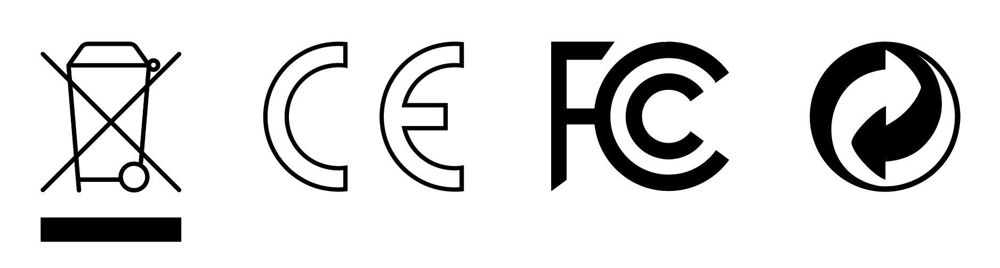

# Mavrik Technical Information

## Care & Maintenance

Unplug product from its power source before cleaning. Please only use clean and dry microfiber cloths for cleaning the Mavrik Blaster & Accessories. Do not clean the device with any liquid or chemical cleansers. Do not clean the surface of the device with alcohol or any other abrasive cleaning solution. Only use non-abrasive, alcohol-free anti-bacterial wipes and wipe gently.

- Do not leave the Mavrik Blaster & Accessories in direct sunlight. Exposure to direct sunlight can damage the plastics over time by discoloring them.
- As with any electronic devices, avoid exposure to water or fluids.
- Operating environment temperature: 10-40&deg;C / 50-104&deg;F, min. humidity 5%, max humidity 95% RH (non-condensing).
- Non-operating shipping/storage: -30-65&deg;C / -22-149&deg;F, 85% RH.
- Store components in a safe, climate-controlled environment when not in use to minimize unintentional damage or environmental exposure.

## Electrical Specifications

| Component | Rating | Continuous Output Power |
| --- | --- | --- |
| Mavrik Blaster | 100W | 60W |
| Charging | 100W | 100W |

## FCC Warning

Any changes or modifications not expressly approved by the party responsible for compliance could void the user's authority to operate this equipment.

This equipment has been tested for Class B digital device compliance under part 15 of the FCC Rules.

These limits are designed to provide reasonable protection against harmful interference in a residential installation.

This equipment may cause harmful interference if it is not installed and used in accordance with the instructions.

If this equipment causes harmful interference to radio or television reception, try one or more of the following measures:

- Reorient or relocate the receiving antenna.
- Increase the separation between the equipment and the receiver.
- Connect the equipment to an outlet on a circuit different from the receiver.
- Consult the dealer or an experienced radio/TV technician for help.

This device complies with part 15 of the FCC Rules. Operation is subject to the following two conditions:

1. This device may not cause harmful interference.
2. This device must accept any interference received, including interference that may cause undesired operation.

This device has been evaluated to meet general RF exposure requirements. The device can be used in portable exposure condition without restriction.

Designed In New Orleans  
&copy;2025 All Rights Reserved StrikerVR, Inc.
