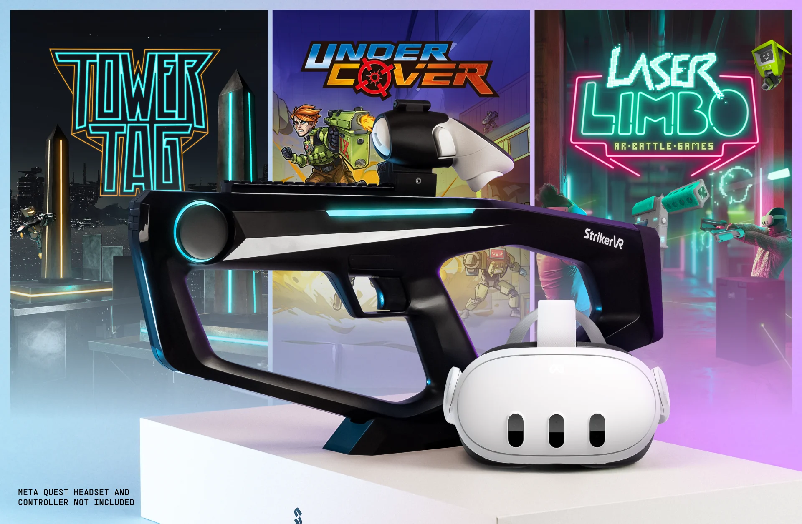

# What is the StrikerVR: Mavrik?

## The Mavrik is our most advanced VR controller--redefining gameplay with compatible titles.

The StrikerVR **Mavrik** is the ultimate haptic gaming peripheral designed for the Meta Quest 3 & 3S *(not included in purchase)*. This innovative VR blaster comes bundled with three amazing games: [Tower Tag](/docs/mavrik-at-home/games-for-the-mavrik/tower-tag), [Laser Limbo](/docs/mavrik-at-home/games-for-the-mavrik/laser-limbo), and [Under Cover](/docs/mavrik-at-home/games-for-the-mavrik/under-cover).

The Mavrik is a cutting-edge haptic technology, unlike any gaming controller that has come before it.

Providing recoil as well as immersive, tactile feedback, the Mavrik allows users to experience mixed and virtual reality with the high-end equipment of location-based entertainment but the at-home content they love.

With a host of exciting haptic profiles, this device provides depth and immersion not possible with standard hand controllers.

As an emergent technology, the Mavrik isn't out-of-the-box compatible with all Quest games. StrikerVR is looking to developers to help us grow our library of [compatible games](https://strikervr.com/pages/games) that will pioneer the new gaming frontier.

Interested developers can reach out to our team via the [StrikerVR Discord](https://discord.com/invite/mbMm3FWAgm).
