# Designing Haptic Effects in Unity

## An overview of the functionality and use of the motors to create haptic experiences.

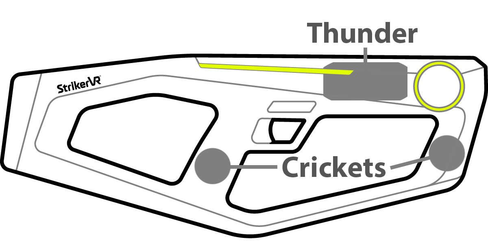

## Thunder

**A linear motor that is mounted internally and located approximately between the LED strips and touchpads in the Mavrik-Pro.**

The Thunder motor is capable of creating strong vibrations and virtual recoil effects. The frequency range of the Thunder motor is from 1hz to 20hz.

## Crickets

**Two resonant actuators, one present in each of the hand grips of the Mavrik-Pro.**

The Cricket actuators are capable of playing frequencies from 1hz to 2,000hz. This means the Crickets' range is over 6 octaves of musical tones including infrasound frequencies below 20hz.

## Motor Overview

One way to look at the haptic motors in the Mavrik-Pro is almost analogous to the concept of subwoofer and tweeters in audio speakers. If programmed properly in tandem, the Thunder ("sub") and Crickets ("tweeter") can be used to create high definition haptic effects.

Developers and sound designers can use the Thunder motor to generate virtual recoil while the two Crickets are used to accent the in-game sound effects in a way that allows the end user to "feel" the audio in their hands.

Imagine firing a futuristic laser gun that produces heavy recoil, but you can also feel the ripple of the projectile dissipating as it moves further away from the blaster. To achieve this, the Thunder can be utilized to simulate recoil, and the Crickets to play a two part "chord" with variation in frequency and intensity over time.

The Mavrik-Pro also has a system of touch sensors which can be used to trigger haptic effects that simulate the loading and reloading of various types of handheld projectile launchers, to make real-time adjustment of haptic effects as well as in-game assets, and even to play melodies.

## Haptic Primitives

*All haptic samples are built using the following primitive commands:*

### Pulse

Drives the Thunder motor in the positive direction away from the impact disk.

**Parameters**

- **Intensity:** Distance motor travels from `0.0` - `1.0`.
- **Duration(ms):** Time it takes in milliseconds to reach intensity value.

### Tick

Drives the Thunder motor in the negative direction toward the user.

**Parameters**

- **Intensity:** Distance motor travels from `0.0` - `1.0`.
- **Duration(ms):** Time it takes in milliseconds to reach intensity value.

### Vibrate

Drives either type of motor at a specified frequency, duration, and intensity.

**Parameters**

- **Intensity:** Loudness or amount of force used to drive haptic motors.
- **Frequency(hz):** Integer value for the rate of vibration.
- **Duration(ms):** The amount of time to vibrate.

### Pause

Called for a specific duration to allow for a break or pause in haptic feedback.

**Parameter**

- **Duration(ms):** The amount of time to pause.

## Vibrate

Although the Thunder motor can be asked in certain instances to use the vibrate command, it is generally the Cricket motors that will take vibrate commands due to their dynamic frequency range. The graphic below outlines how to program the Crickets.

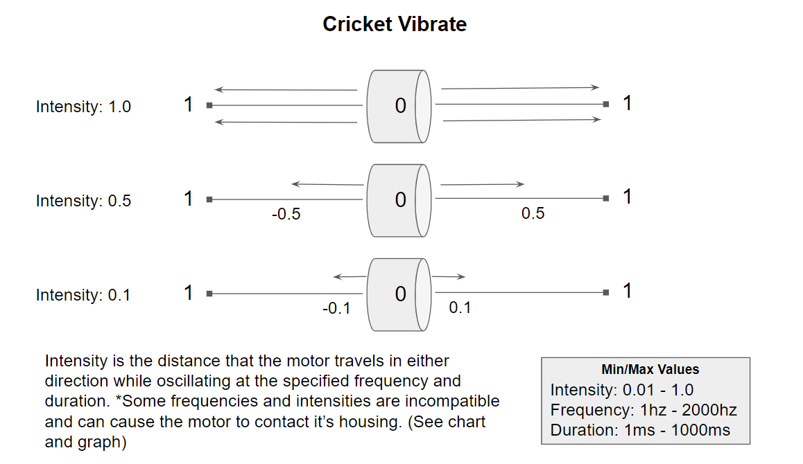

The Crickets are very powerful for creating haptic feedback. There are some frequencies that must be handled with care due to the resonant frequency of the motors and their housing. Use the chart and graph below to manage this frequency band to avoid physical clipping.

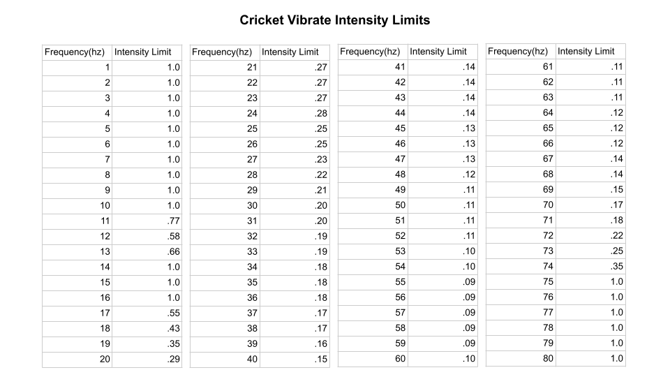

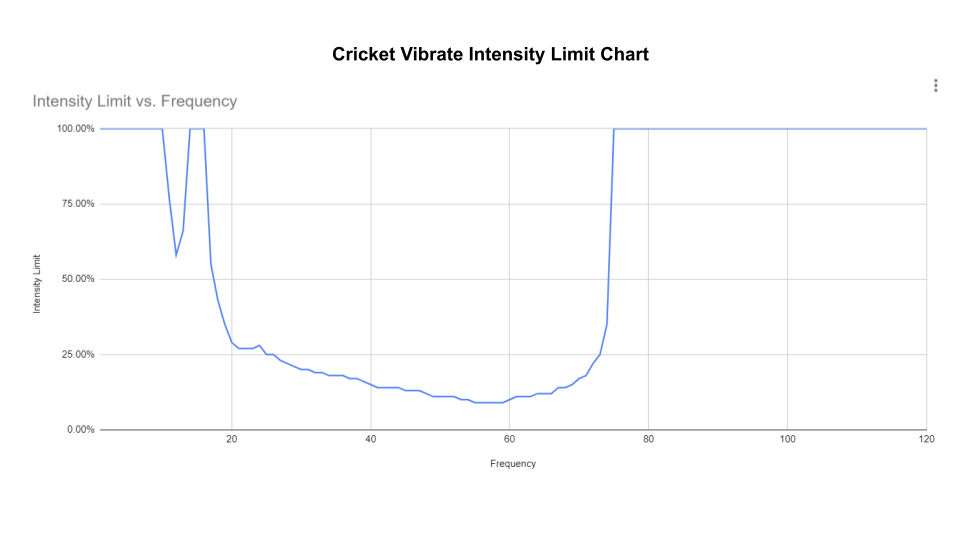

## Virtual Recoil

When simulating the recoil of a conventional handheld weapon, the Thunder motor is the best tool for the job. Utilizing the Pulse, Tick, and Pause commands is essential to producing Virtual Recoil. The graphics below are designed to guide developers who want to build strong haptic samples that can be incorporated into haptic effects.

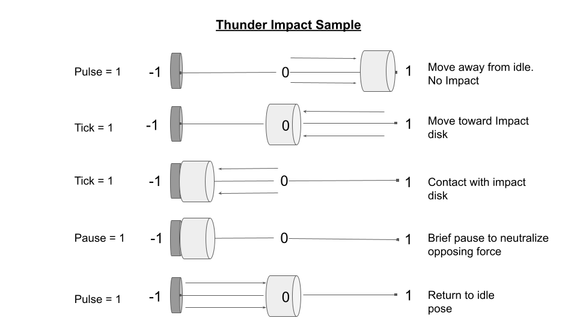

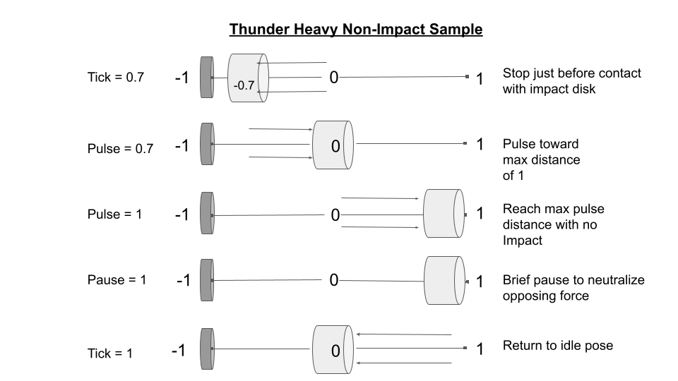

## Programming in Unity

## Haptic Samples

**Samples are designed as a sequence of haptic primitives.**

**Sweep Up Sample (Cricket)**

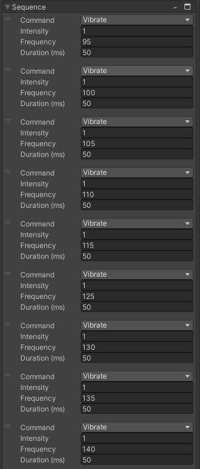

**Shot Heavy Non-Impact (Thunder)**

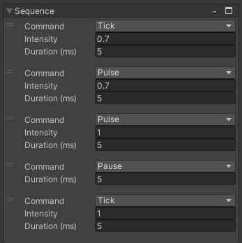

**Shot with Impact (Thunder)**

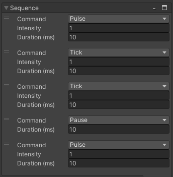

## Haptic Effect

All haptic effects are built using multiple haptic samples.

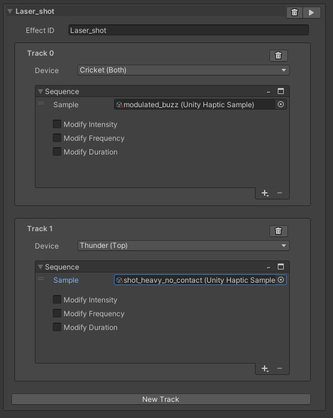

Each effect consists of multiple tracks that can handle each motor independently, or Cricket motors can be paired to play the same haptic sample as in the example above.

Most haptic effects, when designed to maximize haptic feedback, will feature samples for the Thunder motor as well as samples for the Cricket motors.

## Modifiers

Haptic effects also feature modifiers for ease of use. Intensity and Frequency modifiers are adjusted using editable curves that are much faster to use than adjusting primitives and can be accessed at runtime for a more practical approach that resembles generative sound design.

Duration will adjust the full temporal length of a sample to match the value set in duration. For example, if you have a Haptic sample that lasts only 500ms but you need it to last for 600ms, set Duration to 600 and it will evenly stretch out the sequence to meet the Duration.

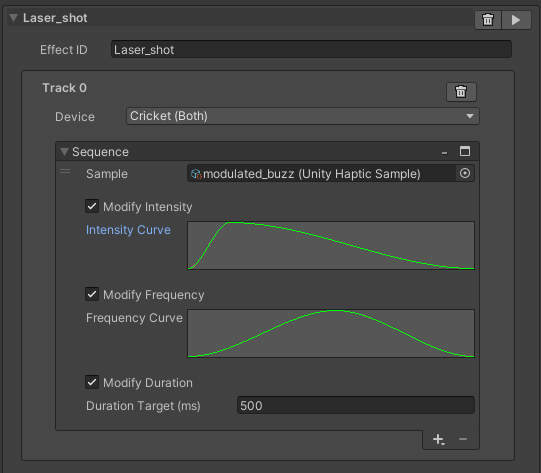

## Haptic Library

Haptic effects are built inside of Haptic Libraries. All effects can be previewed through the library it belongs to during development as long as the Unity runtime is active. This feature also streamlines haptic development.

When previewing haptics with multiple Mavrik-Pro units connected to StrikerLink at one time, developers can choose which blaster to test by choosing a device index.

A game can provide a library of commands on connection, which are stored in the project as JSON and sent along to be stored in memory in StrikerLink until the game disconnects from the *StrikerLink* service.

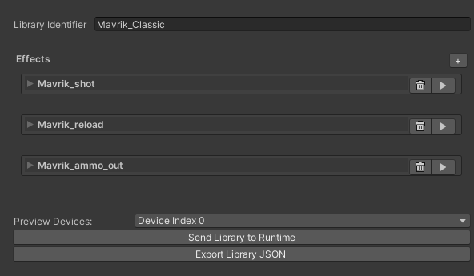
