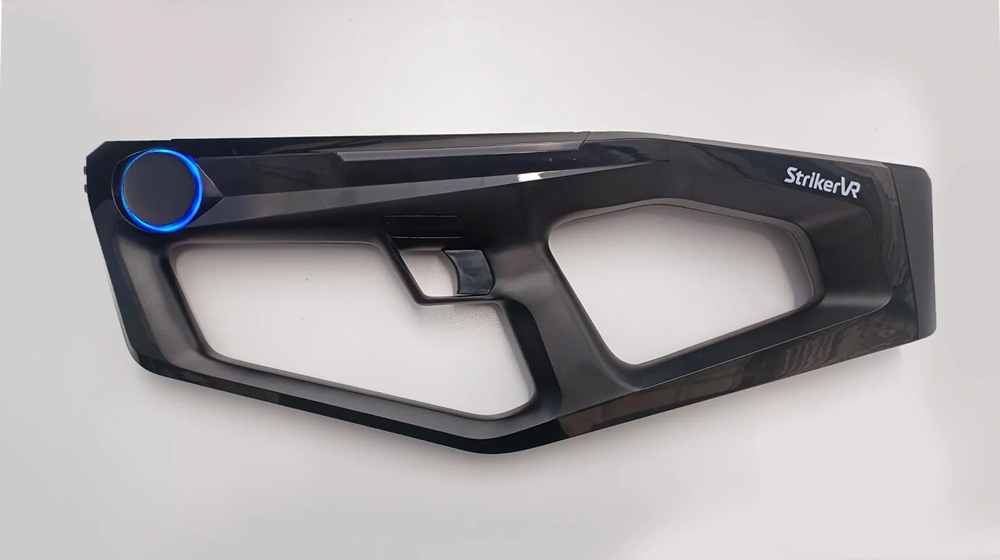
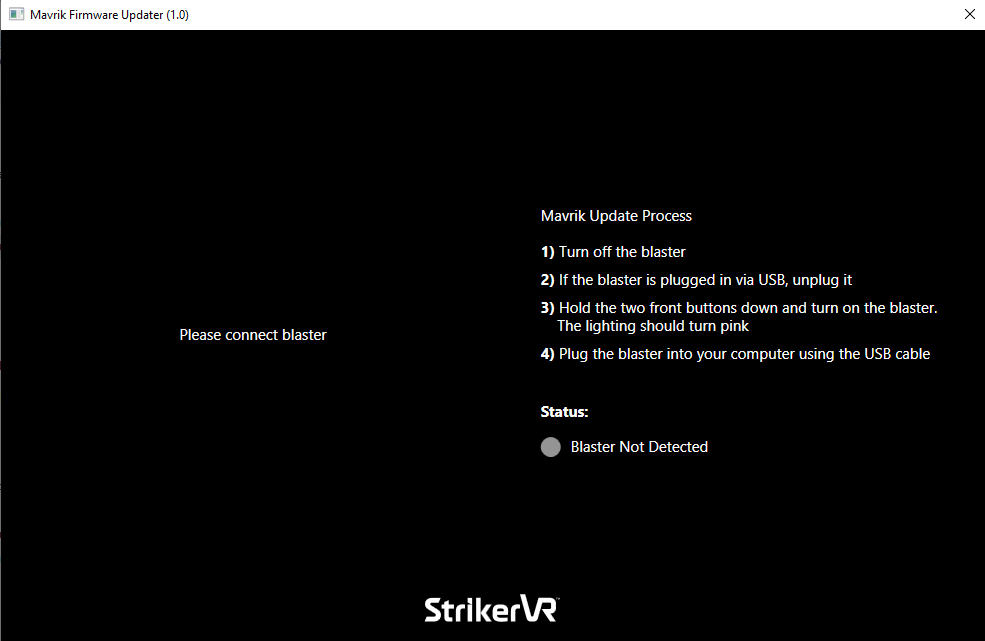
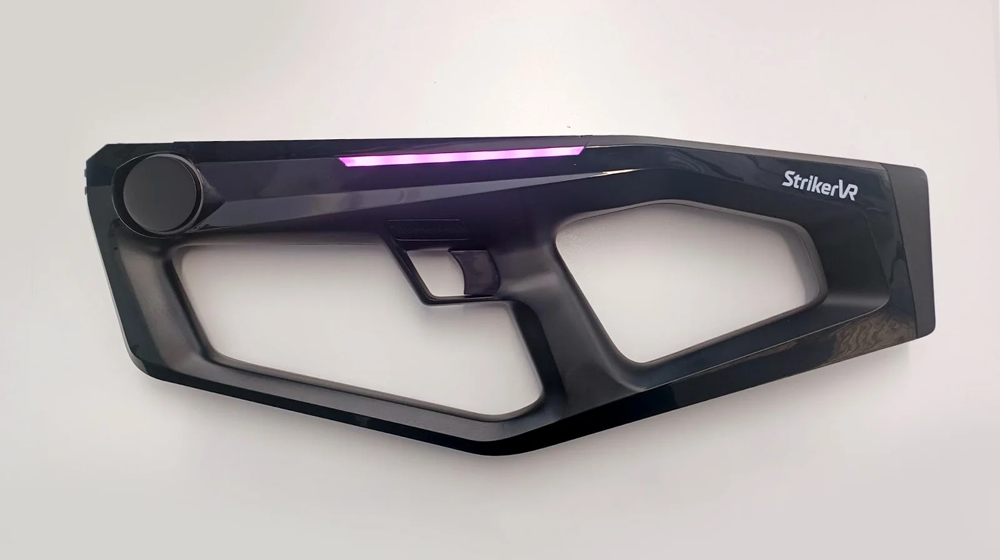
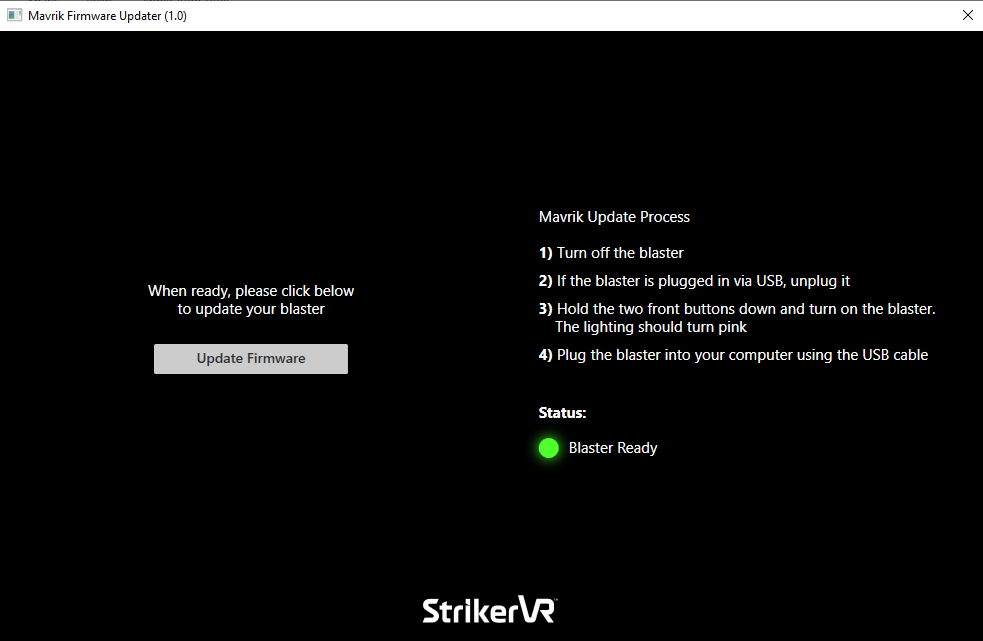
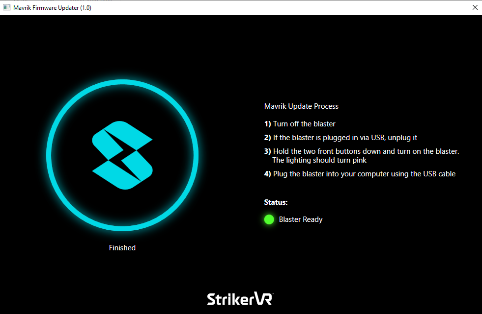

# Firmware

## Instructions for installing the latest firmware for the Mavrik-Pro

## Firmware Downloads

Firmware Updater & Firmware 1.1: [download here](https://strikervr-firmware.s3.us-east-1.amazonaws.com/StrikerVR_FirmwareUpdater.zip)

- Download the Firmware Updater before the firmware.
  - The zip file linked above includes both the firmware updater as well as the latest firmware.

Firmware 1.1 is compatible with StrikerLink 0.7.0 and up. If you are still using Firmware 1.0, you may use up to StrikerLink 0.6.0.

## Trigger Calibration

If this is your first update, you must calibrate the trigger. If your trigger is already calibrated, proceed to the **Update Firmware** section of this page.

1. Turn the blaster on. Then press and hold down menu buttons **F1** and **F2**, as well as both **L** and **R** buttons, until the LED ring turns blue.
   - Simultaneously release all 4 buttons immediately, as soon as the LED ring turns blue.

2. While the LED is blue, not cyan, press **F2**. The LED ring will turn yellow.
3. Pull the trigger all the way. When the LED ring starts blinking green, release the trigger.
4. Press **F2** to confirm. The LED ring will now be solid green.
5. The trigger is now calibrated. Cycle power on your Mavrik-Pro.

## Update Firmware

1. Run the Firmware Updater application.

2. If the blaster is on, turn it off.
3. Boot blaster in Firmware Update Mode: press and hold both of the menu buttons, **F1** and **F2**, at the front of the blaster. While still holding down the menu buttons, press the power button to turn the unit on. It should start with only the LED strip in pink. This means it is ready for an update.

Any other LED orientation indicates the blaster is not ready to update firmware. Turn the blaster off and follow the directions to boot in Firmware Update Mode again.

4. Connect the blaster to the PC via USB-C. The firmware updater should now look like this:

5. Select **Update Firmware**.
6. An Explorer window will open where you can navigate to the `*.bin` file you downloaded from the Help Center. Select it and click **Open**.

A blue circular progress indicator will make its way around the StrikerVR logo until it is finished.

7. Remove the USB-C cable. The blaster now has the latest firmware.
8. Cycle power on your Mavrik-Pro, and you are ready to go.

For additional assistance, please join the [StrikerVR Discord](https://discord.com/invite/mbMm3FWAgm) or email [Support@StrikerVR.com](mailto:Support@StrikerVR.com).
