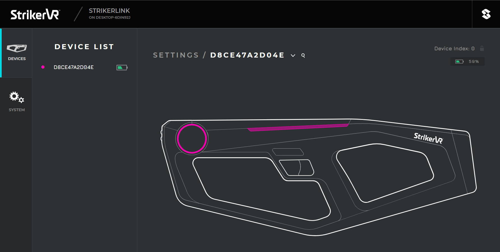
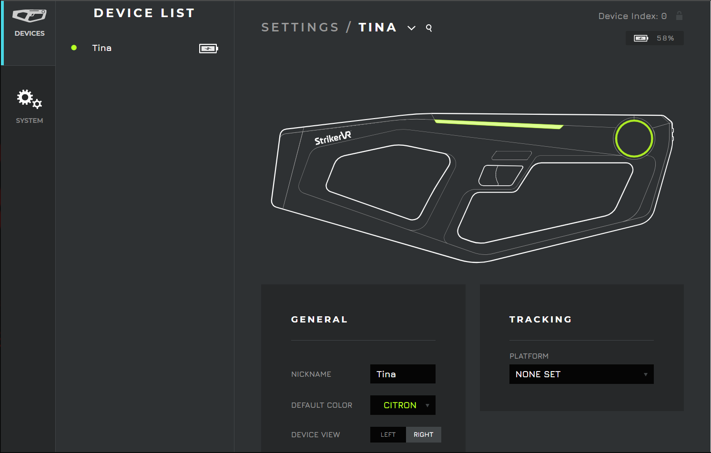
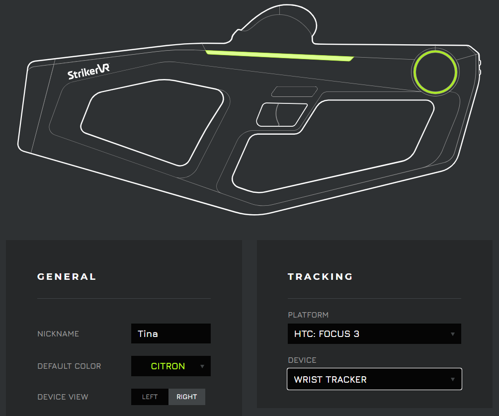
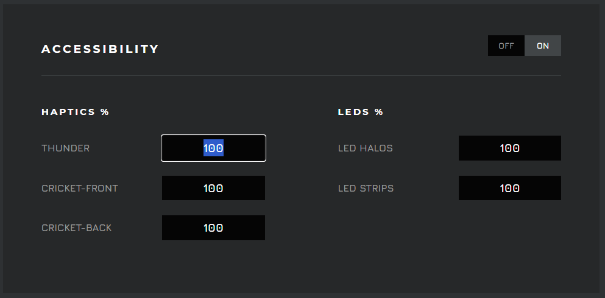
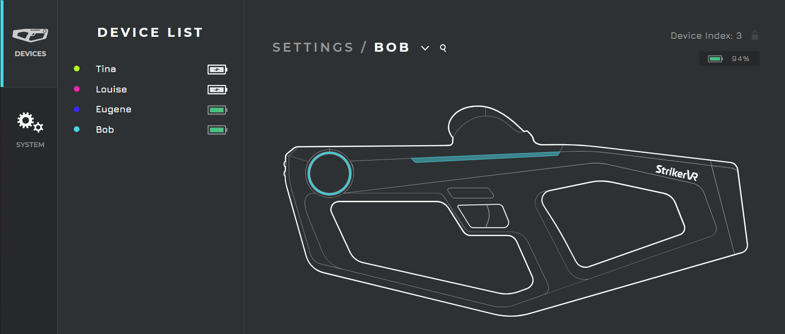
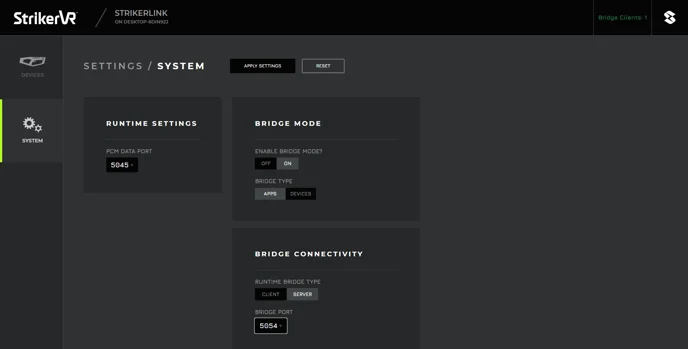
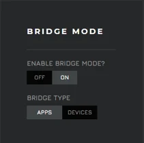
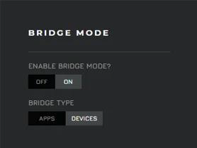
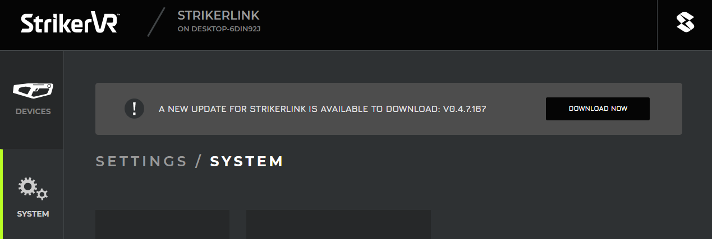

# Mavrik Manager

Use Mavrik Manager when connected to StrikerLink for device configuration of your Mavrik-Pro blaster, and to update StrikerLink.

## Launch Mavrik Manager

1. In your web browser, navigate to [http://localhost:5046](http://localhost:5046).
2. On Android devices, enter your device's IP address followed by port `5046` into your browser, such as `192.168.1.10:5046`.
3. Here you should find the web service UI, **Mavrik Manager**.
4. When your device or devices are connected, they will show up in your device list.

## Device Settings

### General

Here you can name all of your devices for ease of recognition, change the color scheme of the LEDs when connected to StrikerLink, and change the horizontal orientation of the on-screen graphic.

### Tracker and Controller Offsets

1. In development, to get proper offsets there is no need to do anything more than set the XR **Rig** or **Pawn** to work with your desired controller or tracker.
2. Leave the Position and Rotation of the controller/tracker component at the zero matrix: `0,0,0`.
3. Then set your desired tracking platform and device in Mavrik Manager.

We've already done the work of finding the proper offsets for all of the trackers and controllers StrikerLink supports, so you don't have to.

1. Operators can set the platform and device type under **Tracking**, and the in-game blaster assets will mirror the Mavrik-Pro's position in the real world.
2. The Mavrik-Pro graphic in Mavrik Manager will change to reflect the type of tracker or controller associated with the offsets selected.

### Accessibility

Operators can use this window to make adjustments to the intensity of the haptic motors and LEDs.

Imagine a scenario where you need to develop or play a game while others need rest and relaxation, or your lighthouse tracker needs a little less vibration for efficiency.

These options let you dictate how much feedback you get from your Mavrik-Pro.

### Multiple Devices

Mavrik Manager is capable of managing multiple devices at one time.

The first device will register at Index 0 and each subsequent device will increment up by a value of 1 in the device list.

This is where naming and color coordinating your Mavrik-Pros can come in handy.

### Bridge Mode

The function of Bridge Mode is to allow users options for system configuration outside of the **standard configuration**, where the Mavrik-Pro and game are handled by the same machine: PC or Android, but not both.

**Streaming configuration** can be achieved using Bridge Mode by trafficking data between the server (PC), which handles app data such as the game or engine, and client-side Android headsets which handle device data from the Mavrik-Pro.

1. First, enable Bridge Mode on the PC and set the Bridge Type as **Apps**. Then in the Bridge Connectivity window, select **Server** as the Connectivity Bridge Type and select an open port from the list. Once your settings have been chosen, click **Apply Settings**, which is located just above the Bridge Mode window. StrikerLink will now restart automatically with the configuration saved.

2. Next, on your Android devices, enable Bridge Mode and set the Bridge Type as **Devices**. Then in the Bridge Connectivity window, select **Client** as the Connectivity Bridge Type. Input your server's IP address under Bridge Server IP and set the Bridge Port to the same one as your server. Once your settings have been chosen, click **Apply Settings**. Mavrik Manager will prompt the user to restart the headset. StrikerLink should start automatically once the headset has been booted. If it does not start, restart the StrikerLink runtime manually.

3. In the top right corner of the server-side Mavrik Manager window, green lettering should read **Bridge Clients: #**, indicating the number of clients connected to the server. If there is no client connection, the prompt will be red and read **Bridge Clients: 0**.

On the client-side Mavrik Manager window, green lettering will read **Bridge Client Connected**. If there is no connection, red lettering will read **Bridge Client Not Connected**.

The server and all clients will have their own Mavrik Manager browser window available at `IP:5046`.

*If all Mavrik Manager settings have been double checked and there is still no Bridge connection, check your network settings for an active firewall on one of your bridged devices.*

## Updates

StrikerLink updates can currently be accessed without navigating away from Mavrik Manager. Simply click **DOWNLOAD NOW** for the latest version.

For additional assistance, please join the [StrikerVR Discord](https://discord.com/invite/mbMm3FWAgm) or email [Support@StrikerVR.com](mailto:Support@StrikerVR.com).
