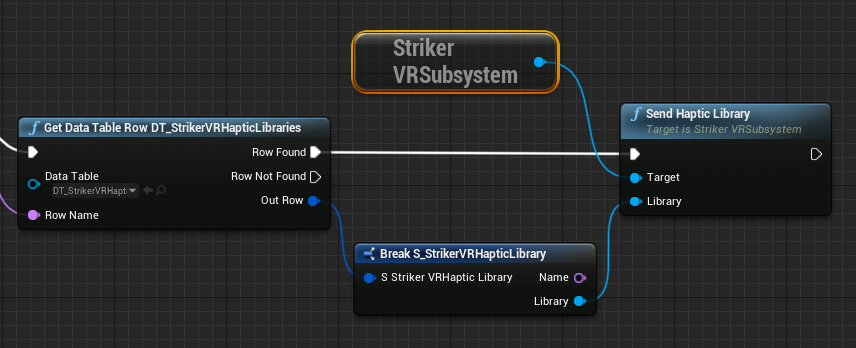
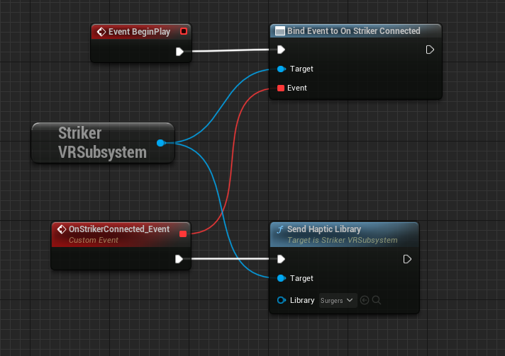
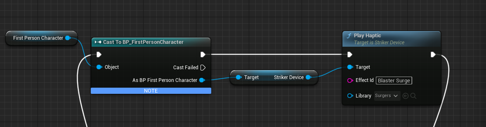

# Unreal Engine SDK

## Unreal Engine Plugins

**StrikerVR provides Mavrik-Pro plugins for the following Unreal Engine versions:**

- [UE 4.27](https://strikervr-unreal.s3.amazonaws.com/public/2024-17-08-19-StrikerVr/2024-17-08-19-StrikerVr-UE4_27.zip)
- [UE 5.1](https://strikervr-unreal.s3.amazonaws.com/public/2024-17-08-19-StrikerVr/2024-17-08-19-StrikerVr-UE5_1.zip)
- [UE 5.3](https://strikervr-unreal.s3.amazonaws.com/public/2024-17-08-19-StrikerVr/2024-17-08-19-StrikerVr-UE5_3.zip)

*Demo projects coming soon.*

**All plugins are compatible with StrikerLink 0.8.0 and up, as well as Mavrik-Pro firmware 1.1.**

## Blaster Assets

**Download Unreal Engine blaster assets: [click here](https://github.com/StrikerVirtualRecoil/Mavrik_UE_Blasters).**

The following assets are included:

- *Mavrik - Classic*
- *Mavrik - Ballzooka*
- *Mavrik - Crossbeaux*

## Integration

### StrikerVR Subsystem

*StrikerVRSubsystem* is a game-instance subsystem. Add the *GetStrikerVRSubsystem* node. This should be the target of any *SendHapticLibrary* functions.

UE 4.27 example use of *StrikerVRSubsystem* with *SendHapticLibrary*.

UE 5.3 example use of Input Actions with *StrikerVRSubsystem* with *SendHapticLibrary* as seen in the UE 5.3 sample project.

## Play Haptic

UE 4.27 example use of *StrikerDevice* with *PlayHaptic*.

Device Index should always be set to zero unless you have a specific multi-device need like a multiplayer screen-shooter.

For additional assistance, please join the [StrikerVR Discord](https://discord.com/invite/mbMm3FWAgm) or email [Support@StrikerVR.com](mailto:Support@StrikerVR.com).
