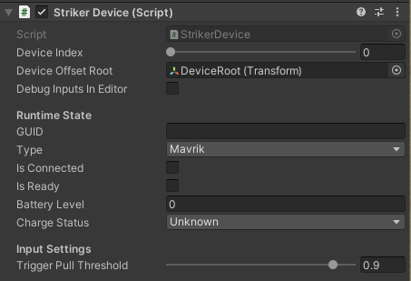
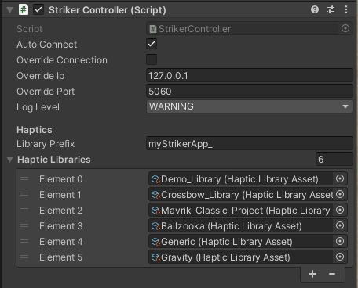
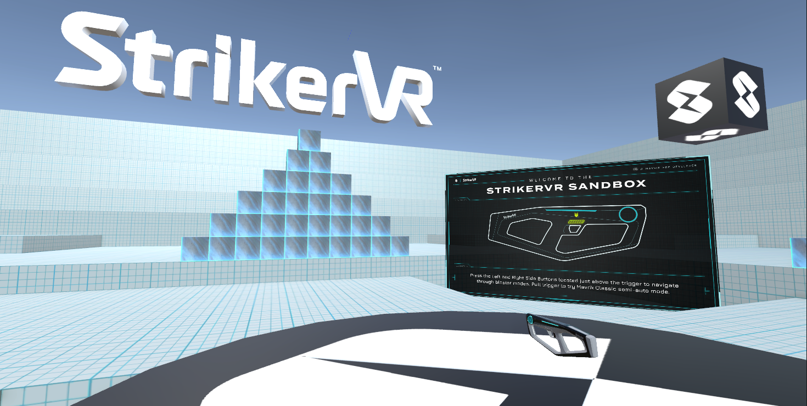

# XR Development in Unity

## 1. Add the Striker Device Script

Add the **Striker Device** script to the tracked object in your XR Rig, such as the left hand, right hand, controller, or tracker object used for the Mavrik-Pro.

## 2. Add the Striker Controller Script

1. Add the **Striker Controller** script to an object at the root of your scene.
2. You can supply additional haptic libraries here when you create them, and they will be sent to the runtime when the scene loads.
3. You can also set a library prefix here so that your app's haptic libraries are uniquely identified and do not collide with other apps or projects.

## 3. Configure Tracking

In the XR Rig object where you have added the Striker Device script, such as the left or right hand, leave the position and rotation at the zero matrix: `0,0,0`.

[StrikerLink](/docs/mavrik-pro-enterprise/mavrik-pro-developer-tools-sdks/strikerlink-runtime) handles tracker offsets, which can be configured using [Mavrik Manager](/docs/mavrik-pro-enterprise/mavrik-pro-developer-tools-sdks/mavrik-manager).

## 4. Explore the Developer Sandbox

We've provided an XR sandbox in Unity to explore the Mavrik-Pro blaster with as little setup as possible.

## 4a. Mavrik-Pro OpenXR Sandbox for Unity

[Mavrik-Pro OpenXR Sandbox for Unity](https://github.com/StrikerVirtualRecoil/MavrikPro_Sandbox_OpenXR.git)

**This sandbox supports the VIVE Focus 3 wrist tracker, Focus 3 controller, and Meta Quest touch controller.**

The Mavrik-Pro Sandbox project uses Unity 2021.3.23. It features three identical scenes that will build for PCVR and Android with the correct settings. The difference in the scenes is controller handling. Try out five blaster modes for a variety of haptic effects and sensor settings.

## 4b. Mavrik-Pro Sandbox for Quest 3 w/ Snapshot Offset Example

[Mavrik-Pro Sandbox for Quest 3](https://github.com/StrikerVirtualRecoil/MavrikPro_Quest3_Sandbox)

**This version of the sandbox is built specifically for the Meta Quest 3 headset.**

The Mavrik-Pro Sandbox project uses Unity 2023.2.13. It demonstrates what we consider the universal standard in offset adjustment of the blaster assets in relation to the controller or tracking game object.

1. Point the muzzle of the blaster in the sandbox at the black cube that says **Snapshot Offsets** and pull the trigger. The model of the blaster will freeze in space and allow you to move your real-world blaster into the same position as your blaster model.
2. When it is properly aligned, pull the trigger again to set the offsets.
3. Click **Save** on the offset UI to save your settings, or use the sliders to make minor adjustments to your offsets and then click **Save**.

**Project settings for specific builds can be found at their respective sites:**

- [OpenXR for Vive Focus 3](https://developer.vive.com/resources/openxr/openxr-mobile/tutorials/unity/)
- [MetaQuest](https://developer.oculus.com/documentation/unity/unity-xr-plugin/)

For additional assistance, please join the [StrikerVR Discord](https://discord.com/invite/mbMm3FWAgm) or email [Support@StrikerVR.com](mailto:Support@StrikerVR.com).
