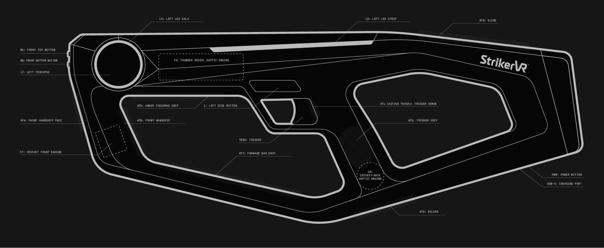
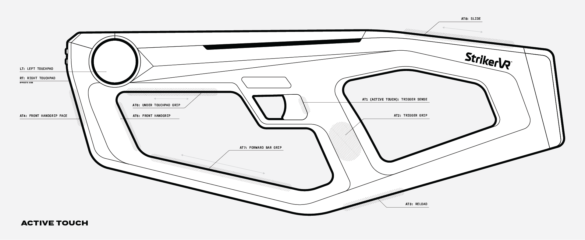
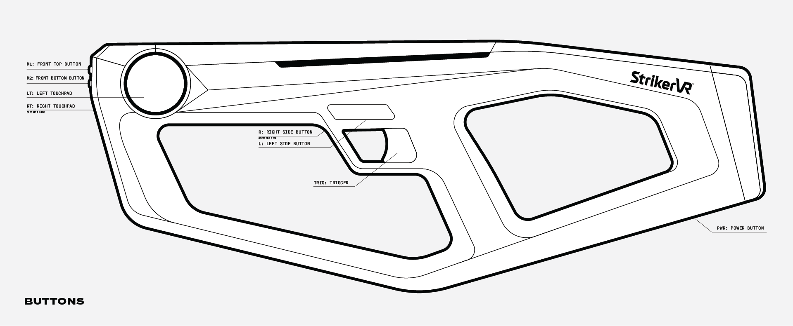

# Best Usage

## Mavrik-Pro Overview & Best Usage

---

## Active Touch Usage

**About**

- Capacitive areas are known as Active Touch.
- AT areas replace buttons and can withstand high-use.
- AT is activated with any touch, not just hand interaction.
- Manipulate in-game assets with Active Touch surfaces.
- Full-range touchpads for locomotion in room-scale experiences.

**Recommendations**

- **Reload 01:** Tap **AT3** at bottom of grip.
- **Reload 02:** Utilize **AT8** for shotgun or crossbow slide reload.
- **Reload 03:** Pump **AT6** for supersoaker, pump shotgun, etc.
- **Grab:** Grab items using slide motion along **AT7**.
- **Throw:** Slide back to front on **AT7** or **AT8** to toss items such as grenades, traps, etc.

---

## Button Usage

**Recommendations**

- **L/R:** Can be used to cycle weapon types. These buttons are not intended for high-use such as the trigger or Active Touch.
- **TRIG:** The trigger is a high-use button utilized for firing or activating a tool.
- **M1/M2:** These are menu buttons. These buttons are not intended for high-use such as the trigger or Active Touch.
- **PWR:** The power button does not require a hard push. Please do not use excessive force.
- **Select:** In freeroam, press and hold **LT/RT** to highlight and release to select items.
- **Run:** In room-scale, press and hold **LT/RT** to run.
