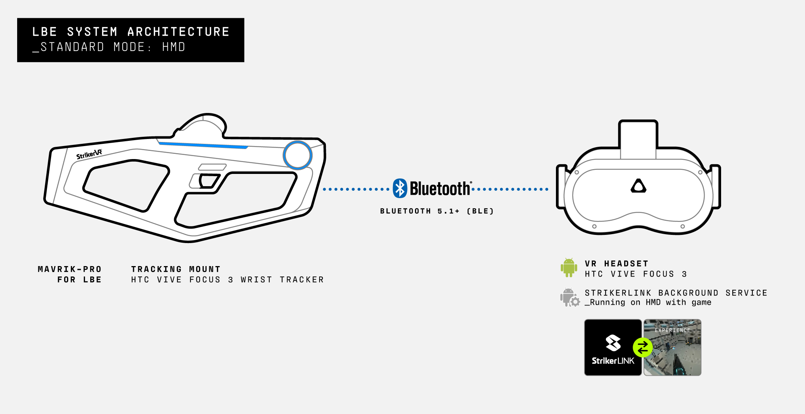
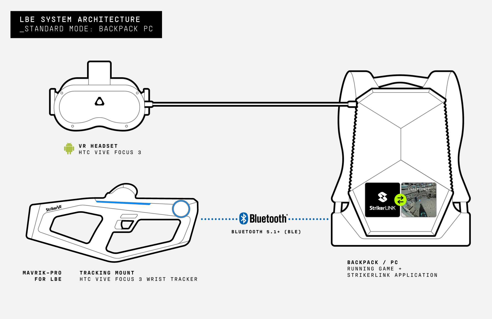
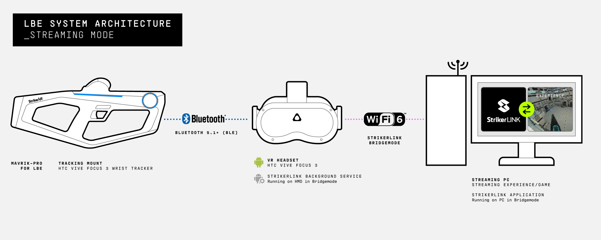
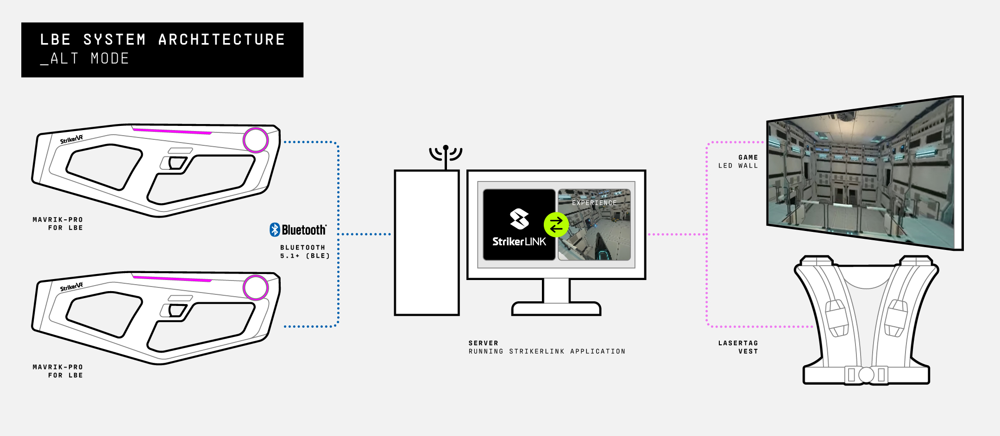

# System Architecture

## Standard Mode

**Standard Mode accommodates the following deployment methods: running a game directly on the HMD or on a Backpack PC that the user carries.**

The Mavrik-Pro connects directly to the HMD via BLE 5.1+, and the StrikerLink Background Service forwards data to the game.

Backpack PC: The HMD is plugged directly into the Backpack PC, and the Mavrik-Pro is connected via the Backpack PC's BLE 5.1+ connection. The Mavrik-Pro blaster then connects directly to the StrikerLink application, and its data is forwarded to the game running on the Backpack PC.

_Integration example images using HTC VIVE Focus 3._

:::note
Standard Mode will work with a stationary laptop/desktop PC, but is not ideal.
:::

---

## Bridge Mode

**Bridge Mode accommodates the most popular integration method for LBE, where a PC is used to stream the video data to the HMD over a WiFi 6 connection.**

Streaming from PC: The Mavrik-Pro connects directly to the HMD via BLE 5.1+. StrikerLink runs on the HMD. **Bridge mode must be enabled in StrikerLink in this use case.**

The StrikerLink instance on the HMD, when in Bridge mode, passes button and sensor data to the PC over the HMD's WiFi 6 connection, while haptic and LED data is passed back to the Mavrik-Pro from the PC.

_Integration example images using HTC VIVE Focus 3._

---

## ALT Mode

**Alternative (ALT) Mode accommodates other non-specific use cases where the deployment of the Mavrik-Pro blaster(s) can be in a non-VR attraction, particularly when aiming is accomplished with lasers at screens and/or laser TAG vests.**

Central Server with Custom Tracking: Maintaining blasters using the BLE 5.1+ connection under 50 feet is accomplished with a central server, and targeting can be accomplished with an alternative tracking cover that incorporates the correct laser.

These tracking covers can be custom-built according to the specific needs of the LBE provider.

Please contact StrikerVR for more information if you are interested in this integration mode.

---

For additional assistance, please join the [StrikerVR Discord](https://discord.com/invite/mbMm3FWAgm) or email [Support@StrikerVR.com](mailto:Support@StrikerVR.com).
