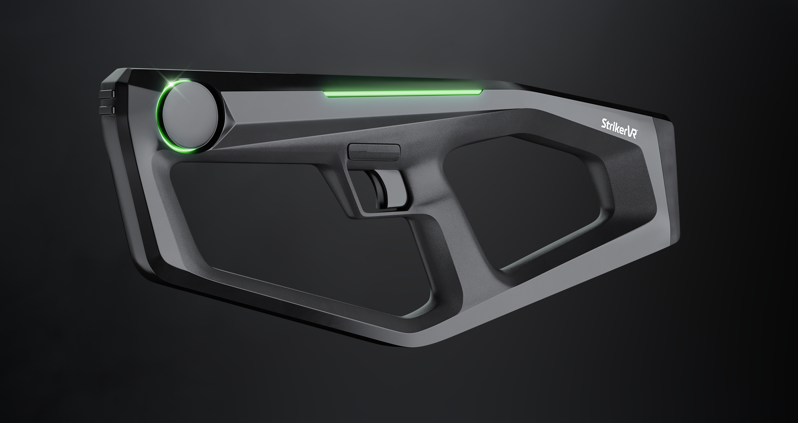

# What is the Mavrik-Pro?

## The Mavrik-Pro is a VR blaster peripheral specifically designed for immersive enterprise activations.

Those looking to utilize the most advanced VR peripheral in the development and testing of applications and experiences can look to the Mavrik-Pro. This device is permitted for use in full commercial deployments and production environments.

Its innovative recoil and haptic technologies unlock incredible force effects that can simulate limitless tools and environments. You need to feel it to believe it.

With the StrikerVR Mavrik-Pro, players will experience virtual reality like never before--the future of VR gaming starts now.
