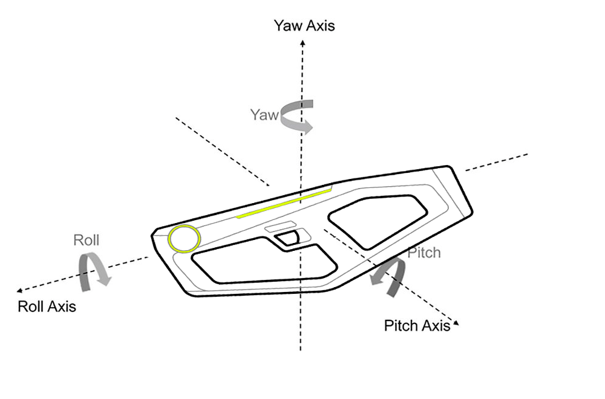

# Demo Mode

## Mavrik-Pro Demo Mode

When powered on, if the Mavrik-Pro is not paired to a device, it defaults to **Demo Mode**. Demo mode demonstrates haptics without requiring a game engine.

## 1. Turn unit ON with Power Button

- Startup haptic plays and the Mavrik-Pro is in Mode #1.
- The unit will advertise for BLE pairing in all demo modes. When the Mavrik-Pro is idle for 15 seconds or more the LED strip will slowly pulse in cyan.
- Pulling the trigger will return back to the light effects and haptics of the current demo mode. BLE pairing advertisements are still in progress in the background.

## 2. Cycle through different demo modes by pushing the Right-Side Button one time.

### Mode #1 Rapid Fire, cobalt lights

1. Pull the Trigger to fire.

### Mode #2 Rapid Impact Fire, blue lights

1. Pull the Trigger to fire.

### Mode #3 Dynamic Fire, azure lights

1. Pull and hold the Trigger and use the Top-Rear Slide Sensors to adjust the haptic strength.
2. Release the Trigger and use the Forward-Bar-Grip Slide Sensors to adjust the frequency. Touching the furthest forward sensors will be high frequencies of fire, and the closest sensors will be slower frequencies.
3. Pull the Trigger again to test the frequency change.

### Mode #4 Single Fire Laser, cyan lights

1. Pull the Trigger to fire.
2. When you are out of ammo after 33 shots, a "ramping down" haptic will play and the Line LED will blink red rapidly.
3. Press the Reload Sensors underneath the main handgrip to reload, triggering a "ramping up" haptic effect.

### Mode #5 Maestro, yellow lights

Use the Forward-Bar-Grip, Under Bar-Grip, and Slide Sensors to play various musical tones and LED patterns at any time in this mode.

1. Under bar grip plays quick white LED forward pattern and musical arpeggio.
2. Forward bar and slide bar plays solid LED colors such as cyan, purple, red, yellow, green, and musical scales.

### Mode #6 Laser Sword, white lights

This mode resembles laser swords in popular space battle movies.

1. The idle state will generate a drone: white LED stutters back and forth.
2. Rotate the Mavrik-Pro on the Roll Axis to hear and feel the Laser Sword states:
   - 45 degrees: Swing Haptic
   - 90 degrees: Swing Haptic, one octave up
   - 135 degrees: Crash Haptic

### Mode #7 Plasma Cannon, indigo lights

1. Pull and hold the Trigger. When released, the fire haptic will have an intensity that corresponds to how long the trigger was held. For every second up to 5 seconds the haptics increase in intensity.
   - 1 second: cyan LED forward and back - light haptic
   - 2 seconds: green LED forward and back - light-medium haptic
   - 3 seconds: yellow LED forward and back - medium haptic
   - 4 seconds: red LED forward and back - extended medium-heavy haptic
   - 5 seconds: violet LED forward and back - extended heavy haptic
2. Wait for the blue "Cooled Down/Idle" LED to pull and hold the trigger again.

For additional assistance, please join the [StrikerVR Discord](https://discord.com/invite/mbMm3FWAgm) or email [Support@StrikerVR.com](mailto:Support@StrikerVR.com).
