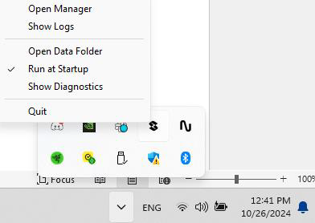

# Mavrik-Pro Quick Start Guide

## 1. Install StrikerLink

#### **StrikerLink** is the application that allows headsets to connect to the Mavrik-Pro blaster. Without installing StrikerLink, the blaster will not work with any headset.

### Headset Installation

1. Plug the USB-C cable connected to your headset into your PC or laptop.
2. Ensure USB debugging is enabled on your headset.
   - Once you open the **StrikerLink Android Installer**, it will alert you if debugging has not been enabled correctly.
3. Navigate to the folder **C:/ProgramFiles/StrikerVR/StrikerLink/Tools/android/StrikerLink-Android-Installer/**.
4. Double-click **StrikerLink-Android-Installer.exe** to run the installer.
5. Follow the instructions provided by the installer.
6. Once the installation is complete, a notification should appear in your headset indicating that **StrikerLink has successfully started**.

### Debugging

1. If the installer does not recognize your device, double-check that USB debugging is enabled.
2. Ensure you have the latest USB drivers installed on your PC.
3. Make sure to allow any permissions requested by your headset during the process.

## 2. Connect the Mavrik-Pro

#### After **StrikerLink** is installed, you can now connect the Mavrik-Pro to your PC or headset via Bluetooth.

### PC

1. Turn your Mavrik on.
2. Navigate to your **Bluetooth** manager in **Windows Settings**.
3. Connect the blaster, similar to connecting any other Bluetooth device to your PC.
4. Once connected, open **StrikerLink.exe** and open the **Manager**.

   

5. Once in the manager, ensure the blaster is correctly connected.

### Headset

1. Turn your Mavrik on.
2. Navigate to the **Bluetooth** manager in **Settings**.
3. Connect the blaster, similar to connecting any other Bluetooth device to your headset.

### Basic Usage

1. If you are using the **desktop version of StrikerLink**, you can now run the application.
2. If you are on an **Android based XR headset** and have **StrikerLink installed**, the Mavrik-Pro will automatically connect to StrikerLink.
   - If the Mavrik-Pro does not automatically connect, simply navigate to your app library and run the app.
3. When a connection is made to StrikerLink, the **Mavrik-Pro LEDs will cascade forward in purple**, followed by **solid purple** after the cascade. Your blaster is now ready to interface with your game or game engine.

## 3. Experiment inside the StrikerVR Blaster Lab!

Play with haptic profiles and different blasters in the **StrikerVR Blaster Lab** [here](https://drive.google.com/file/d/1b0aKB8M04Z06oZo7i4DRQmIV25rEy2Fp/view?%20usp=sharing).

## 4. Closing/Finalization

When finished, exit any VR applications running on the headset.

1. Disconnect the USB cable if connected.
2. On PC, quit out of the StrikerLink application, disconnect, and forget the Mavrik blaster.
