# Tracker Mount Installation

## Mavrik Pro Top Plate Installation

  <iframe
    title="Mavrik Pro top plate installation video"
    src="https://www.youtube.com/embed/_uBpGIWUbSA?wmode=opaque&rel=0"
    allow="accelerometer; autoplay; clipboard-write; encrypted-media; gyroscope; picture-in-picture; web-share"
    allowFullScreen
  />

## Step 1

Dismount the stock top plate by removing all 6 screws holding it down.

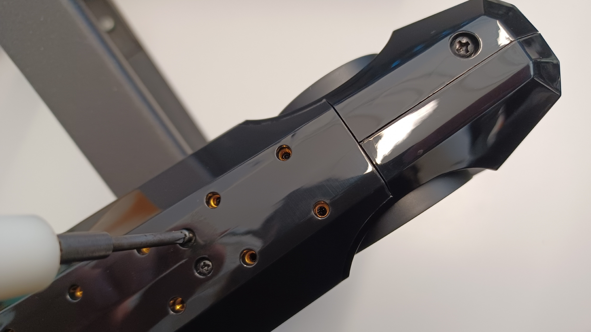

## Step 2

Remove the punch-out plate by carefully applying pressure to it, making sure not to damage any internal parts in the process. This step is not necessary for the Wrist Tracker/Pico Tracker top plate.

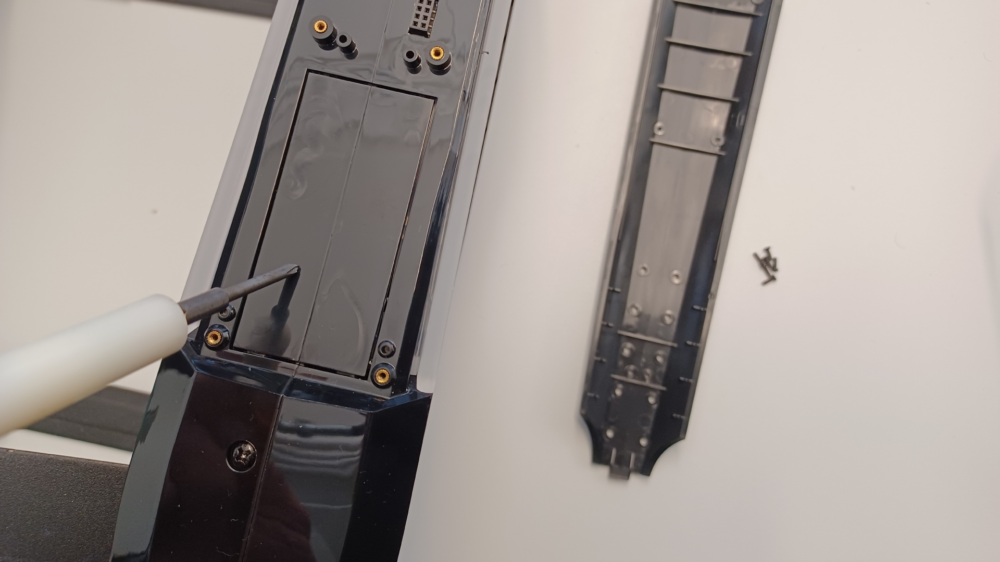

The Mavrik-Pro should look like this after a successful removal.

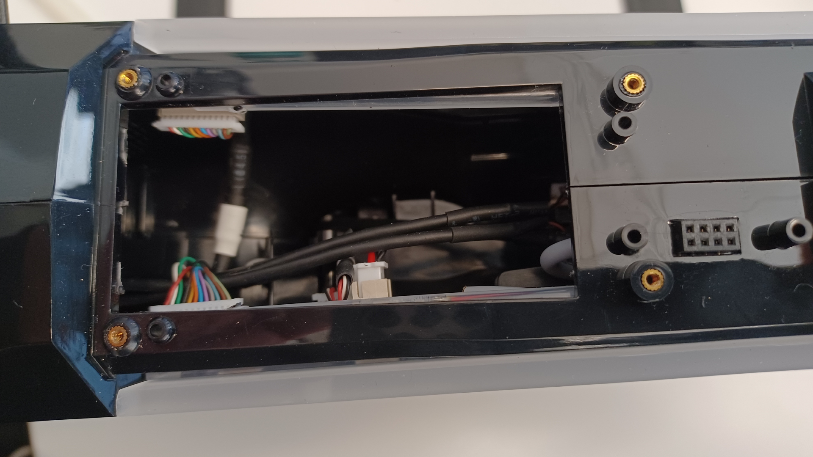

## Step 3

Insert the chosen tracker mount by first inserting the tongue of the mount into the groove at the front of the mounting area. Then apply pressure to the rear of the mount, making sure that the pins enter the connector.

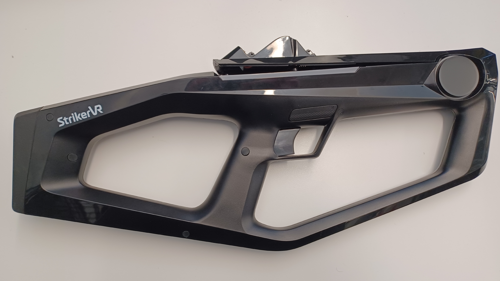

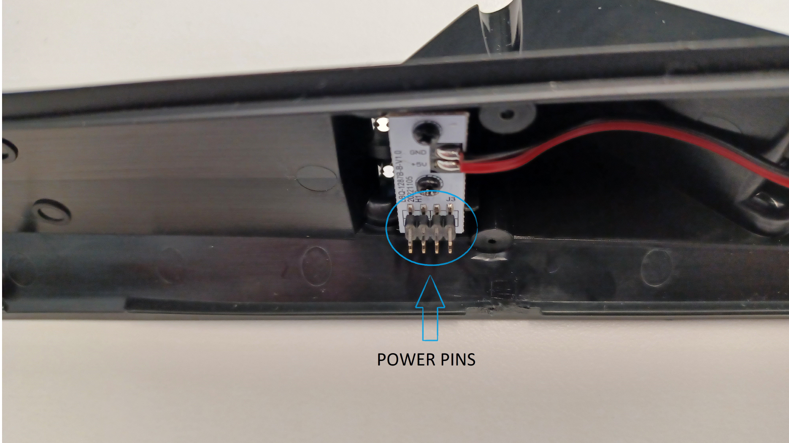

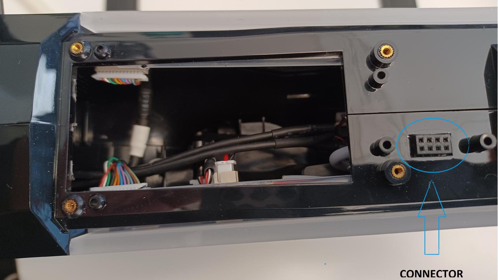

## Step 4

Secure the mount to the blaster using the same screws that were removed in Step 1.

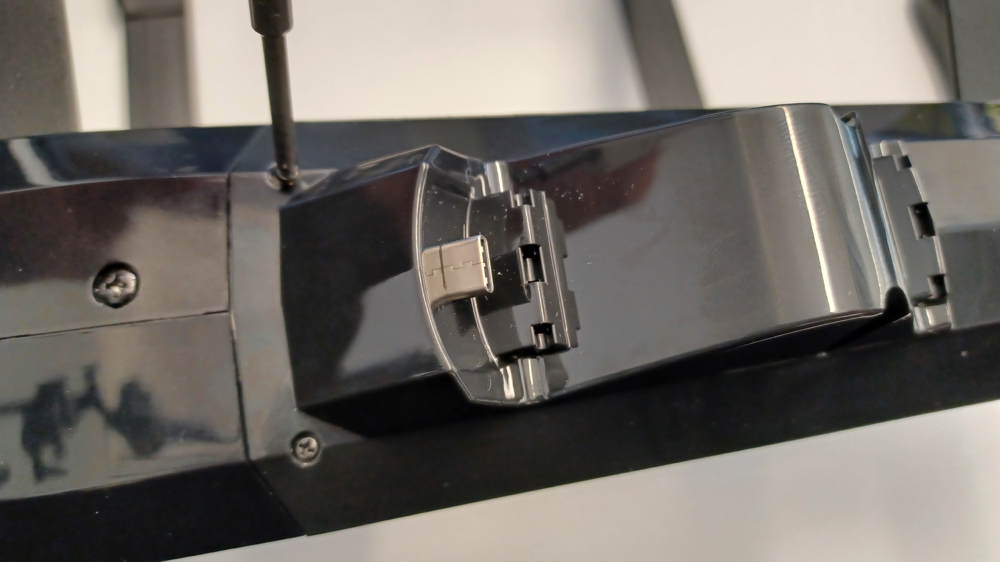

## Pico Swift Motion Tracker and VIVE Wrist Tracker Mount

The VIVE Wrist Tracker requires a T6 star bit to remove the wristband from the tracker. The same watch pins that held the wristband to the tracker must be used to mount the tracker to the Mavrik-Pro.

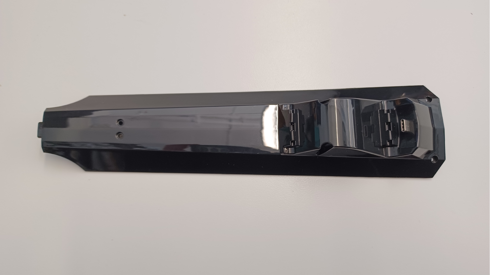

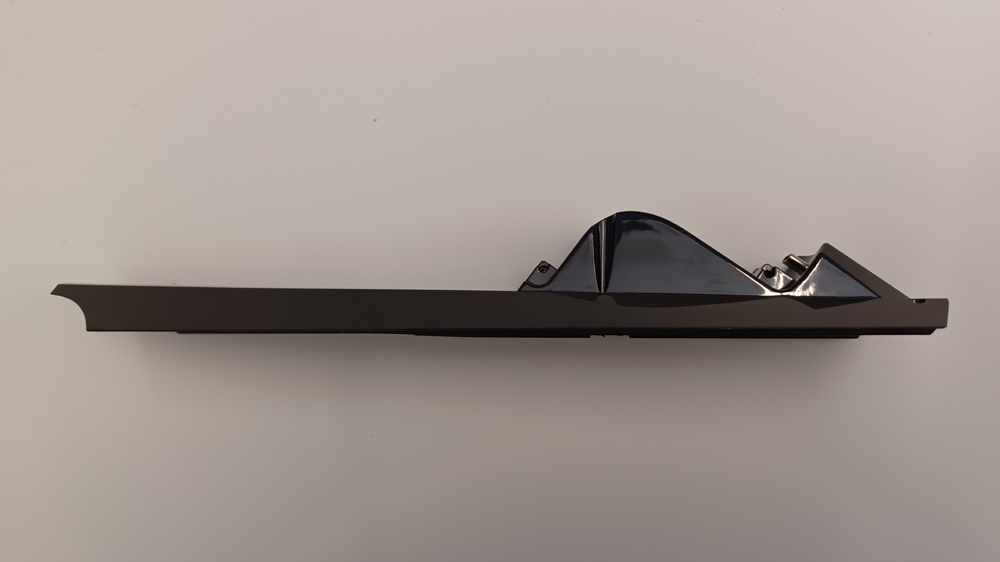

#### A 3D printed attachment allows this top plate to house and charge the Swift Motion Tracker by Pico. This part is supplied with purchase of a Mavrik Pro when Pico is the designated platform.

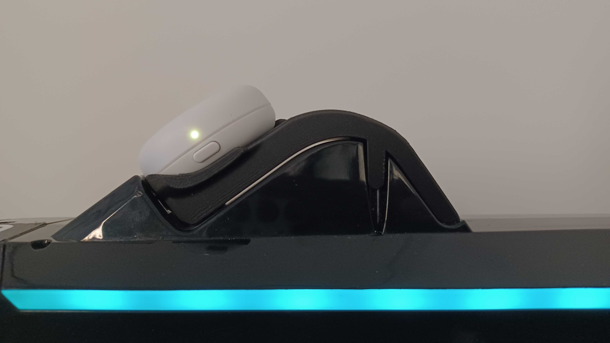

## Picatinny Rail Mount

The Picatinny rail mount is used to mount XR controllers like the Quest 3 Touch Controllers and the VIVE Focus 3 controllers to the Mavrik-Pro.

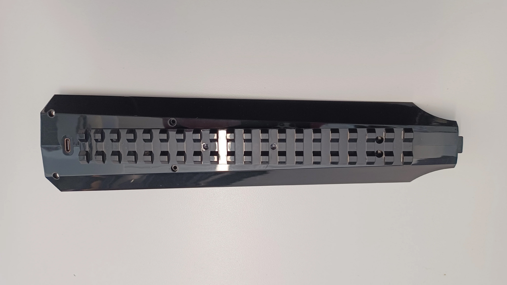

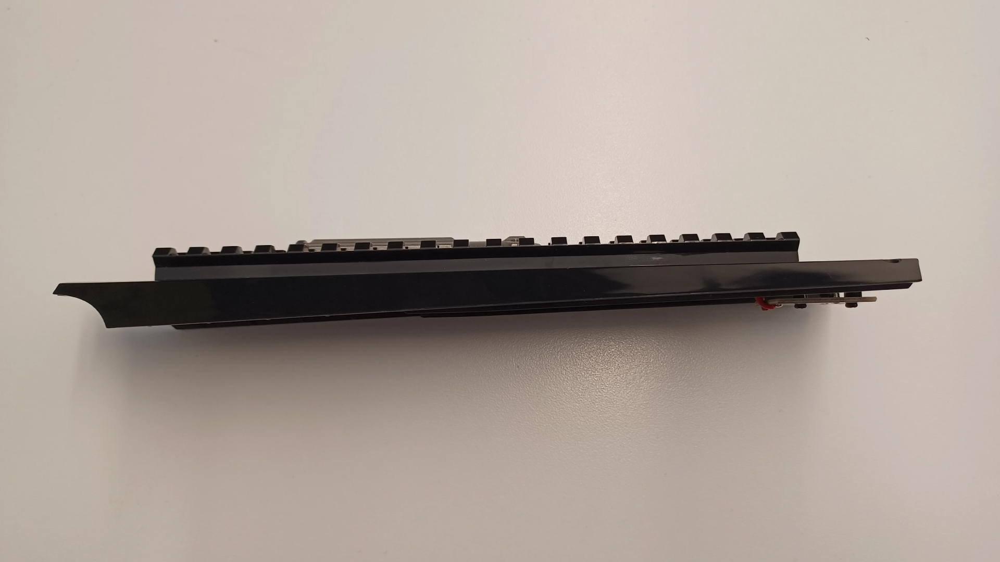

:::note
Left controller and Logitech Stylus are supported for Meta Quest 3. Right controller 3D files are available on request. Right controller and wrist tracker are supported for Vive Focus series. Vive puck mount is available but not advised due to haptic interference with light-house tracking.
:::

For additional assistance, please join the [StrikerVR Discord](https://discord.com/invite/mbMm3FWAgm) or email [Support@StrikerVR.com](mailto:Support@StrikerVR.com).
